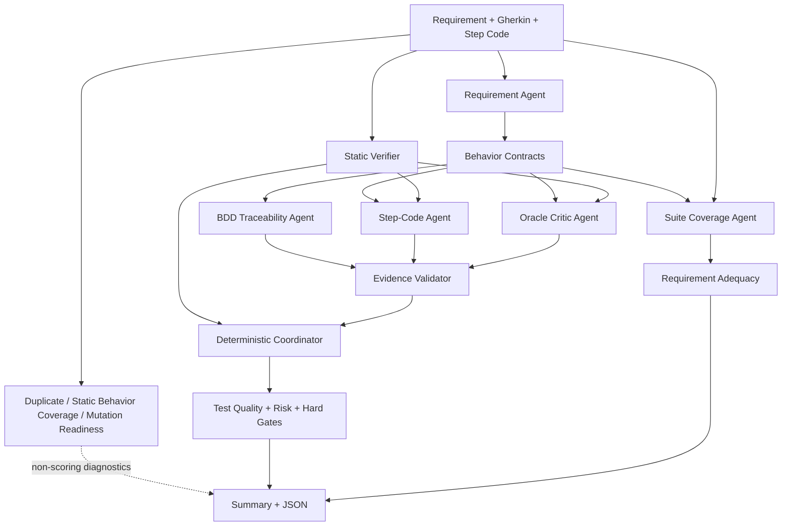
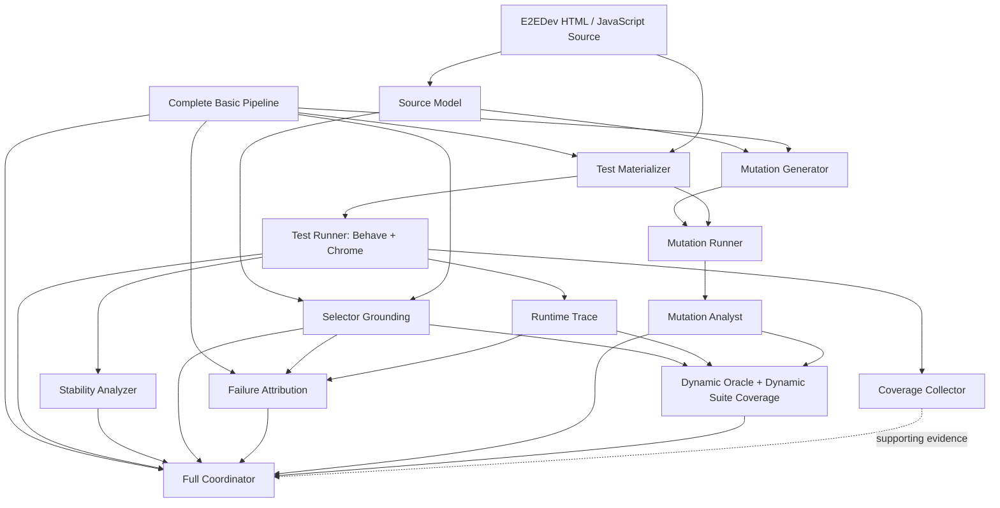

# test_evaluator

`test_evaluator` is an evidence-driven multi-agent evaluator for E2EDev BDD/Selenium tests.

It supports two evaluation modes:

- **Basic Mode** reads requirements, Gherkin scenarios, and Python step code. It does not require application source code or launch a browser.
- **Full Mode** runs the complete Basic pipeline first, then adds E2EDev application source, Chrome execution, coverage, stability analysis, and real mutation testing.

Only traceable evidence can affect a score. Claims that cannot be verified from an input field or runtime artifact are marked `UNKNOWN`; they are never treated as passes.

## 1. Environment Setup

### 1.1 Requirements

- Python 3.11 or newer
- pip
- An OpenAI API key when semantic agents are enabled with `--live`
- Chrome or Chromium, Behave, and Selenium for Full Mode
- Node.js only when Istanbul JavaScript coverage is required

Create and activate a virtual environment:

```bash
python3.11 -m venv .venv
source .venv/bin/activate
python -m pip install --upgrade pip
```

On Windows PowerShell:

```powershell
py -3.11 -m venv .venv
.venv\Scripts\Activate.ps1
python -m pip install --upgrade pip
```

### 1.2 Install Basic Mode

From the repository root, run:

```bash
python -m pip install -e '.[dev]'
```

This installs:

- The `test-evaluator` command
- The OpenAI Python SDK
- Pydantic
- pytest

### 1.3 Configure the OpenAI API key

On Linux or macOS:

```bash
export OPENAI_API_KEY="your-api-key"
```

On Windows PowerShell:

```powershell
$env:OPENAI_API_KEY="your-api-key"
```

The OpenAI SDK resolves the environment variable directly. Do not place the key in a CSV file, command argument, report, or committed configuration file.

The default model is `gpt-5-mini`. Select another available model with `--model`.

```bash
test-evaluator --help
```

### 1.4 Install Full Mode dependencies

```bash
python -m pip install -e '.[dev,full]'
```

Confirm that Chrome or Chromium is available on `PATH`:

```bash
google-chrome --version || chromium --version
```

If `chromedriver` is present on `PATH`, the evaluator uses it. Otherwise, Selenium may use Selenium Manager to obtain a compatible driver.

Node.js dependencies are required only for Istanbul coverage:

```bash
node --version
npm install
```

With `--coverage-method auto`, external JavaScript is instrumented with Istanbul when possible. Inline scripts, or environments without working Istanbul instrumentation, fall back to Chrome DevTools precise coverage.

### 1.5 Verify the installation

```bash
test-evaluator --help
pytest -q
```

Every `test-evaluator` command in this document can also be invoked as:

```bash
python -m test_evaluator.cli
```

## 2. Basic Mode

### 2.1 What Basic Mode evaluates

Basic Mode is intended for cases where only test data is available, application source has not yet been collected, or browser execution is too expensive. It reads CSV, JSONL, or an E2EDev `requirment_with_tests.json` file containing:

- `fine_grained_reqs`: the fine-grained requirement under evaluation
- `excutable_test_test_case`: the Gherkin `Given/When/Then` scenario
- `excutable_test_step_code`: the Python/Behave/Selenium step implementation
- Project, requirement, and test identifiers

Basic Mode answers the following question:

> Based on static evidence from the requirement, scenario, and test code, does this test express the intended behavior, implement its steps, and contain an automatic oracle capable of detecting the relevant fault?

Basic Mode cannot prove that a test runs successfully in a real browser, and it never reports real code coverage or a real mutation score.

This input structure follows [E2EDev: Benchmarking Large Language Models in End-to-End Software Development Task](<references/E2EDev- Benchmarking Large Language Models in End-to-End Software Development Task.pdf>), which combines fine-grained requirements, BDD scenarios, Python step implementations, and a Behave-based pipeline. This evaluator assesses the quality of those tests; it does not reproduce the paper's E2ESD framework-ranking formula.

### 2.2 Run Basic Mode

Use `--live` for a complete semantic Basic evaluation:

```bash
test-evaluator \
  --mode basic \
  --input e2edev_sample.csv \
  --output reports/basic-live \
  --live \
  --timeout 180
```

Evaluate the first eight CSV records:

```bash
test-evaluator \
  --mode basic \
  --input e2edev_sample.csv \
  --output reports/basic-first8 \
  --live \
  --limit 8 \
  --timeout 180
```

`--limit N` selects the first N tests after filtering. It does not mean requirement N.

Filter by project, requirement, or test:

```bash
test-evaluator \
  --mode basic \
  --input e2edev_sample.csv \
  --output reports/basic-req1 \
  --live \
  --projects E2ESD_Bench_01 \
  --requirements 1
```

Run only the deterministic static checks by omitting `--live`:

```bash
test-evaluator \
  --mode basic \
  --input e2edev_sample.csv \
  --output reports/basic-static
```

This static smoke run does not require an API key, but the BDD, Step-Code, and Oracle dimensions remain `UNKNOWN`. Their missing weight normally leaves less than 70% known evidence, so Basic Test Quality is reported as `N/A`. Use this form to validate ingestion and deterministic analysis, not as a complete Basic evaluation.

A pre-generated Basic Mode example for `E2ESD_Bench_01` and `E2ESD_Bench_02` is available in [`example_analysis/basic_E2ESD_Bench_01,E2ESD_Bench_02/summary.md`](example_analysis/basic_E2ESD_Bench_01,E2ESD_Bench_02/summary.md). The corresponding machine-readable output is [`evaluation.json`](example_analysis/basic_E2ESD_Bench_01,E2ESD_Bench_02/evaluation.json).

### 2.3 Basic multi-agent system



Requirement, BDD, Step-Code, Oracle, and Suite Coverage are OpenAI-backed semantic agents. Static verification, evidence validation, assertion data-flow analysis, duplicate detection, static mutation readiness, and final coordination are deterministic components.

| Agent or component | Main input | Responsibility | Direct Basic scoring effect |
|---|---|---|---|
| Requirement Agent | Fine-grained requirement | Converts the requirement into at most six independent, observable behavior contracts | No direct weight; supplies the rubric used by other agents |
| BDD Traceability Agent | Behavior contracts and Gherkin | Checks whether the scenario expresses the relevant precondition, action, and expected result | Spec alignment |
| Step-Code Agent | Gherkin, Python code, and static facts | Checks decorators, actions, selectors, helpers, and Then implementations | Step traceability |
| Oracle Critic Agent | Behavior contracts, code, and assertion data flow | Checks whether assertions observe the result required by the behavior | Oracle strength |
| Static Verifier | Gherkin and Python AST | Checks syntax, step bindings, constant assertions, fixed sleeps, and event data flow | Robustness |
| Suite Coverage Agent | All scenarios for one requirement | Reviews behavior coverage, candidate gaps, duplicates, and meaningful scenario diversity | Requirement Adequacy |
| Coordinator | Structured reviews | Normalizes statuses and calculates scores, risk, and hard gates | Deterministic aggregation |

The BDD, Step-Code, and Oracle agents do not receive one another's findings. They share the requirement contract and deterministic static facts, but independently assess different aspects of the test. This limits cross-agent anchoring and keeps disagreement visible.

### 2.4 Evidence validation and status normalization

Every non-`UNKNOWN` finding must quote an allowed input field. Before scoring, the evaluator checks whether the quote actually appears in that field:

- A finding with verified evidence keeps its `PASS`, `WARNING`, or `FAIL` status.
- A finding with no verifiable quote is downgraded to `UNKNOWN`.
- A review with no verified findings becomes `UNKNOWN`.

Finding severity is then used to normalize each dimension:

- One `CRITICAL/FAIL` or at least two `MAJOR/FAIL` findings produce dimension `FAIL`.
- One `MAJOR/FAIL`, a minor failure, or a high-severity warning produces dimension `WARNING`.
- A verified pass with only informational or minor suggestions remains `PASS`.
- A dimension without reliable evidence becomes `UNKNOWN`.

Statuses map to scores as follows:

| Status | Score |
|---|---:|
| `PASS` | 1.0 |
| `WARNING` | 0.5 |
| `FAIL` | 0.0 |
| `UNKNOWN` or `SKIPPED` | Excluded from numerator and denominator |

Agent confidence is retained in the JSON report, but it does not silently replace the published dimension weights.

### 2.5 Basic Test Quality

Each test has a maximum score of 100:

| Dimension | Weight | Meaning |
|---|---:|---|
| Spec alignment | 30% | Whether Gherkin expresses the relevant requirement precondition, action, and result |
| Step traceability | 25% | Whether Python steps implement the Gherkin Given/When/Then statements |
| Oracle strength | 35% | Whether a behavioral fault would cause the automatic assertion to fail |
| Robustness | 10% | Static syntax, binding, placeholder, and synchronization quality |

The score is calculated as:

```text
Basic Test Quality
  = 100 × sum(known dimension weight × status score)
          / sum(known dimension weight)
```

At least 70% of the dimension weight must be known; otherwise, the score is `N/A`. `Basic Evidence: 100%` means that all four dimensions have scoreable evidence. It does not mean that the test is 100% correct.

Oracle strength receives the largest Basic weight because test presence and fault-detection ability are different properties. [Oracle-based Test Adequacy Metrics: A Survey](<references/Oracle-based Test Adequacy Metrics- A Survey.pdf>) treats oracle adequacy as a distinct test-adequacy concern. This project implements that idea through an independent Oracle Critic and the `critical_oracle_gap` gate. The exact 35% weight is a project-specific rule, not a formula taken from the paper.

### 2.6 Basic Requirement Adequacy

Requirement Adequacy evaluates the complete suite for one requirement. It is not an average of the test-quality scores.

| Component | Weight |
|---|---:|
| Behavior coverage | 50% |
| Mean Oracle strength across tests in the suite | 30% |
| Overall Suite Coverage Agent status | 20% |

At least 60% of the component weight must be known; otherwise, Requirement Adequacy is `N/A`.

Treating behavior coverage as an independent dimension is directly inspired by [Beyond Coverage and Kill Scores: Empirically Measuring Test Suite Behavioural Gaps](<references/Beyond Coverage and Kill Scores- Empirically Measuring Test Suite Behavioural Gaps.pdf>). The paper shows that high structural coverage or mutation kill scores can coexist with untested expected behavior. The evaluator therefore extracts behaviors from requirements and maps scenarios to them instead of substituting code coverage for requirement coverage. The 50/30/20 weights remain project-specific.

### 2.7 Risk and hard gates

The numerical score and risk classification are complementary:

- Any hard gate produces `critical` risk.
- A major adverse finding or a failed dimension produces `major` risk.
- A minor adverse finding or a warning dimension produces `medium` risk.
- All-unknown evidence produces `unknown` risk.
- No adverse evidence produces `low` risk.

Basic hard gates are:

| Hard gate | Meaning |
|---|---|
| `step_code_not_parseable` | Python step code cannot be parsed |
| `scenario_missing` | No Gherkin Scenario is present |
| `missing_step_implementation` | A Gherkin step has no matching Behave implementation |
| `critical_oracle_gap` | A core expected result has no effective automatic oracle |

In Basic Mode, a hard gate makes risk `critical` but does not apply an additional numerical cap. Interpret a result using `Score + Risk + Hard Gates`; there is no single built-in pass threshold.

### 2.8 Non-scoring Basic diagnostics

- **Static Behavior Coverage** deterministically maps scenarios to strong or weak behavior declarations.
- **Suite Duplicate Analysis** detects exact scenarios, semantic duplicates that only change data, and duplicate oracle shapes.
- **Static Mutation Readiness** uses requirement observability and assertion data flow to classify general fault hypotheses as `likely_detected`, `likely_survives`, or `unknown`.

Mutation readiness is not a mutation score. Basic Mode does not modify source code or execute tests, and readiness never contributes to Basic Test Quality or Requirement Adequacy.

This separation also reflects the distinction between coverage and fault-detection capability discussed in [Mutation-Guided Unit Test Generation with a Large Language Model](<references/Mutation-Guided Unit Test Generation with a Large Language Model.pdf>). That paper uses mutation feedback to generate tests; Basic Mode only estimates general fault detectability and does not reproduce its generation algorithm.

### 2.9 Golden calibration

The repository includes 24 human-labelled Basic agent decisions for detecting model or prompt drift:

```bash
test-evaluator-calibrate

test-evaluator-calibrate \
  --evaluation reports/basic-live/evaluation.json
```

See [`calibration/README.md`](calibration/README.md) for the label format and comparison rules.

[How well LLM-based test generation techniques perform with newer LLM versions?](<references/How well LLM-based test generation techniques perform with newer LLM versions?.pdf>) reports that model version and baseline strength can materially change test-generation evaluation results. This project does not reproduce that generation study, but it keeps `--model` configurable and uses a fixed golden set so that a model upgrade is not assumed to preserve previous calibration.

## 3. Full Mode

### 3.1 Clone E2EDev

Full Mode requires application source code. Clone [SCUNLP/E2EDev.git](https://github.com/SCUNLP/E2EDev.git):

```bash
git clone https://github.com/SCUNLP/E2EDev.git ../E2EDev
```

This example places the evaluator and E2EDev in sibling directories:

```text
workspace/
├── test_evaluator/
└── E2EDev/
```

The evaluator creates an isolated workspace for every selected test. It does not edit the cloned E2EDev source tree.

### 3.2 Run Full Mode

The following smoke run evaluates the first two tests discovered in one project:

```bash
test-evaluator \
  --mode full \
  --e2edev-root ../E2EDev \
  --projects E2ESD_Bench_01 \
  --output reports/full-smoke \
  --live \
  --limit 2 \
  --workers 2 \
  --runner-timeout 60
```

Enable repeated baselines, coverage, and real mutation testing for a fuller evaluation:

```bash
test-evaluator \
  --mode full \
  --e2edev-root ../E2EDev \
  --projects E2ESD_Bench_01 \
  --output reports/full-evaluation \
  --live \
  --workers 2 \
  --runner-timeout 60 \
  --runtime-retries 1 \
  --stability-runs 2 \
  --coverage \
  --coverage-method auto \
  --mutation \
  --max-mutants 30 \
  --max-mutants-per-project 30
```

A pre-generated Full Mode example for `E2ESD_Bench_01` is available in [`example_analysis/full_E2ESD_Bench_01/summary.md`](example_analysis/full_E2ESD_Bench_01/summary.md). The corresponding machine-readable output is [`evaluation.json`](example_analysis/full_E2ESD_Bench_01/evaluation.json).

Useful controls include:

| Option | Purpose |
|---|---|
| `--requirements 1,3` | Select requirement IDs or full suite keys |
| `--tests 1,2` | Select test IDs or full record keys |
| `--max-tests-per-project N` | Apply an independent test cap to each project |
| `--workers N` | Bound baseline, coverage, and mutation concurrency |
| `--runtime-budget S` | Set a soft wall-clock budget for baseline and stability work |
| `--mutation-budget S` | Set a soft wall-clock budget for mutation execution |
| `--browser-stubs speech,clipboard` | Explicitly stub selected browser APIs |
| `--no-headless` | Run Chrome with a visible window for debugging |
| `--resume` | Reuse compatible checkpoints when input and configuration hashes match |

### 3.3 Full multi-agent system

Full Mode completes every Basic stage before adding source and runtime evidence:



| Agent or component | Responsibility |
|---|---|
| Source Model | Extracts DOM anchors, event handlers, state effects, storage operations, and external APIs from HTML and JavaScript |
| Selector Grounding | Checks Selenium locators and Gherkin `data-testid` anchors against source and estimates selector stability |
| Test Materializer | Copies one test and its application into an isolated Behave workspace and rewrites local entry paths |
| Test Runner | Executes a baseline with Behave and Chrome and separates `pass`, `fail`, `timeout`, and `env_error` |
| Stability Analyzer | Repeats an unchanged baseline and identifies flaky tests |
| Runtime Trace | Collects failed steps, DOM snapshots, console data, storage calls, network events, and browser API evidence |
| Failure Attribution | Separates test defects from application, environment, evaluator, contract, and indeterminate failures before scoring |
| Coverage Collector | Collects Istanbul or Chrome DevTools JavaScript coverage |
| Mutation Generator | Produces bounded mutations for events, DOM updates, API calls, literals, comparisons, booleans, and arithmetic |
| Mutation Runner | Executes each mutant in a private workspace and records killed, survived, invalid, or timeout outcomes |
| Mutation Analyst | Excludes invalid, timeout, and suspected-equivalent outcomes before calculating mutation score |
| Dynamic Oracle | Uses real killed and survived mutants to assess whether a test oracle distinguishes injected faults |
| Dynamic Suite Coverage | Maps runtime, selector-grounding, and mutation evidence back to requirement behaviors |
| Full Coordinator | Combines available evidence and applies evidence thresholds and hard-gate score caps |

The execution and failure-evidence design is informed by:

- [An Empirical Evaluation of Using Large Language Models for Automated Unit Test Generation](<references/An Empirical Evaluation of Using Large Language Models for Automated Unit Test Generation.pdf>), which demonstrates the importance of executing generated tests and using failure feedback.
- [YATE: The Role of Test Repair in LLM-Based Unit Test Generation](<references/YATE- The Role of Test Repair in LLM-Based Unit Test Generation.pdf>), which highlights the syntactic and semantic invalidity of generated tests and the value of static checks plus runtime feedback.

This evaluator implements static checks, runtime classification, retry handling, and feedback evidence. It does not currently rewrite or repair the evaluated tests, so it is not a reproduction of TestPilot or YATE.

#### Test-focused failure attribution

A raw baseline failure is not automatically treated as a defective test. The deterministic attribution layer combines:

- Basic Spec, Step-Code, and Oracle review statuses
- Python syntax and missing-step facts
- The failed Gherkin step and runtime error type
- Selector grounding and required source anchors
- Browser console and runtime artifacts

It produces one of the following origins:

| Origin | Test-quality treatment |
|---|---|
| `test_defect` | Runtime score is 0 and a baseline hard gate is added |
| `application_defect` | Neutral; runtime evidence remains unavailable for test scoring |
| `environment_issue` | Neutral |
| `evaluator_issue` | Neutral |
| `contract_or_dataset_mismatch` | Neutral pending contract/source review |
| `indeterminate` | `UNKNOWN`; no test penalty without decisive evidence |
| `no_failure` | Runtime score is 1 |

For example, an assertion failure is classified as an application defect only when the independently normalized Spec, Step-Code, and Oracle dimensions pass and source grounding supports the test. If a failed assertion coincides with an evidence-backed Step-Code or Oracle failure, it is classified as a test defect. Ambiguous selector failures and timeouts remain indeterminate rather than being charged to the test.

### 3.4 Full Test Quality

Full Mode preserves the Basic score and calculates a separate Full Test Quality score:

| Dimension | Weight |
|---|---:|
| Spec alignment | 15% |
| Step traceability | 15% |
| Oracle strength | 20% |
| Baseline runtime result | 20% |
| Mutation effectiveness | 25% |
| Robustness | 5% |

At least 50% of the weight must be known; otherwise, Full Test Quality is `N/A`. Known dimensions use the same normalized weighted formula as Basic Mode.

The Runtime result dimension is test-focused: only a passing baseline contributes 1, and only an evidence-backed `test_defect` contributes 0. Application failures, environment failures, contract/source mismatches, evaluator failures, and indeterminate outcomes contribute `UNKNOWN` and are excluded by the evidence threshold.

The mutation-effectiveness dimension is inspired by [Mutation-Guided Unit Test Generation with a Large Language Model](<references/Mutation-Guided Unit Test Generation with a Large Language Model.pdf>), which argues that mutation outcomes are more informative about fault-detection capability than line or branch coverage alone. The 25% weight and mutation operators are project-specific decisions, not the paper's original configuration.

Full hard gates cap the final numerical score:

| Hard gate | Full score cap |
|---|---:|
| `step_code_not_parseable` | 20 |
| `scenario_missing` | 20 |
| `missing_step_implementation` | 40 |
| `critical_oracle_gap` | 50 |
| `baseline_test_failed` | 60 |
| `baseline_test_timeout` | 60 |
| `mutation_score_zero` | 65 |
| `flaky_runtime` | 75 |

`baseline_test_failed` and `baseline_test_timeout` are added only when failure attribution assigns the outcome to `test_defect`. A raw application failure does not cap the evaluated test's score. Likewise, `flaky_runtime` is added only when mixed repeated outcomes have a test-owned signal, such as a fixed sleep or an already attributed test defect; otherwise, instability remains `UNKNOWN`.

Coverage is reported explicitly but is not a direct Full Test Quality dimension. This avoids equating execution volume with verified behavior. [TESTEVAL: Benchmarking Large Language Models for Test Case Generation](<references/TESTEVAL- Benchmarking Large Language Models for Test Case Generation.pdf>) demonstrates that overall and targeted line, branch, and path coverage expose different test-generation capabilities. This project collects runtime coverage but does not reproduce TESTEVAL's targeted-path benchmark.

### 3.5 Full Requirement Adequacy

Full Requirement Adequacy uses:

| Component | Weight |
|---|---:|
| Behavior coverage | 25% |
| Source grounding | 15% |
| Runtime pass rate | 20% |
| Oracle adequacy | 15% |
| Mutation score | 20% |
| Scenario diversity | 5% |

At least 50% of the weight must be known; otherwise, Full Requirement Adequacy is `N/A`.

Behavior coverage remains independent because source coverage, passing execution, and mutation score cannot individually prove that every expected requirement behavior was validated. This continues the behavioral-gap perspective described earlier.

For test-focused scoring, Runtime pass rate is calculated only over scoreable runtime outcomes: passing baselines and failures attributed to `test_defect`. Application, environment, evaluator, contract/source, and indeterminate outcomes are excluded rather than counted as failed tests. Likewise, a required source anchor that is absent from the application is reported as a contract/source mismatch and does not lower the evaluated test's source-grounding score; a selector invented only by the test can still be penalized.

Mutation score is calculated as:

```text
100 × killed / (killed + survived)
```

Invalid mutants, timed-out mutants, and survived mutants marked as suspected-equivalent are excluded from the denominator. Dynamic Oracle and Dynamic Suite Coverage explain how these outcomes support or contradict the static assessment, but they do not introduce a hidden duplicate scoring weight.

## 4. Reports and Resume

Every run writes at least:

```text
reports/<run>/
├── summary.md
├── evaluation.json
├── config.json
├── inventory.json
├── run_manifest.json
├── checkpoints/
└── projects/<project>/project_summary.md
```

Depending on enabled features, Full Mode additionally writes:

```text
projects/<project>/
├── source_model.json
├── selector_grounding.json
├── runtime_results.json
├── stability_results.json
├── runtime_traces.json
├── coverage.json
├── mutation_plan.json
├── mutation_results.json
└── dynamic_evidence.json
```

Reuse an interrupted run when its input and configuration are unchanged:

```bash
test-evaluator \
  --mode basic \
  --input e2edev_sample.csv \
  --output reports/basic-live \
  --live \
  --resume
```

`summary.md` is intended for human review. `evaluation.json` contains the complete machine-readable schema, findings, evidence, scores, and risk. The evaluator does not write cross-run historical trend files.
