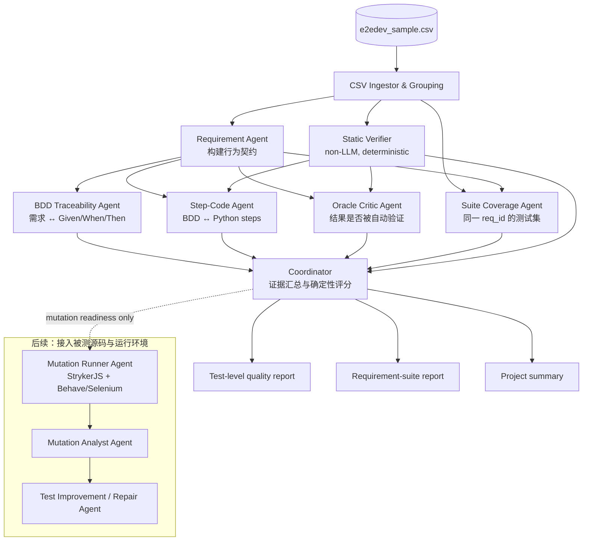

# 基于需求、可追溯性与 Oracle 的多 Agent 测试质量评估系统

## 1. 摘要

本方案提出一个面向生成式端到端测试（E2E test）的多 Agent 质量评估系统。系统以 `e2edev_sample.csv` 中已有的细粒度需求、BDD/Gherkin 场景和 Behave/Selenium 步骤代码为唯一输入，在**不访问被测应用源码、不运行浏览器测试**的约束下，给出可审计的测试质量报告。

系统的核心目标不是判断测试“像不像一段好测试代码”，而是回答三个更具体的问题：

1. 测试场景是否覆盖并忠实表达了给定需求中的行为？
2. Gherkin 中承诺的行为，是否真的被步骤代码执行？
3. 需求的预期结果，是否被一个可观察、非平凡的 test oracle 自动验证？

第一版采用固定、证据驱动的流水线：多个角色从正交维度审查同一测试，而协调器只依据结构化证据汇总结论，不参与自由式多轮讨论。这样既保留 multi-agent 的专业分工，又避免复杂对话引入的上下文膨胀与错误累积。

## 2. 问题定义与范围

### 2.1 输入数据

系统读取 `e2edev_sample.csv`。每行代表一条测试，包含：

| CSV 字段 | 在系统中的用途 |
|---|---|
| `id` | 被测应用/项目标识 |
| `req_id` | 需求标识；同一需求下的测试构成一个 requirement suite |
| `test_id` | 该需求下的测试标识 |
| `requirement_summary` | 应用层背景信息 |
| `fine_grained_reqs` | 评估的主要规格来源 |
| `excutable_test_test_case` | Gherkin/BDD 场景，即测试意图 |
| `excutable_test_step_code` | Python Behave/Selenium 步骤实现，即测试机制 |
| `reference_answer` | 原始基准资源定位信息；v0 不访问该 URL |

当前样本含 5 个 Web 应用、24 个细粒度需求、70 条测试。涉及购物车拖拽、Notes、电影选座、Web Speech 和 Dictionary 等 UI 行为，包含 DOM 状态、`localStorage`、外部 API、重复操作、边界条件和异常输入。

### 2.2 v0 的边界

v0 是一个 **Static, Requirement- and Oracle-aware Test Quality Evaluator**：

- 可以检查 Python 语法、BDD 到步骤代码的映射、需求到断言的可追溯性、oracle 的显式性和场景集的行为覆盖。
- 不能声称测试在真实浏览器中一定通过；CSV 没有被测应用源码、依赖、ChromeDriver 环境或执行日志。
- 不能计算 line/branch coverage 或真实 mutation score；这些指标必须对被测程序执行测试。
- 所有无法由 CSV 证明的结论必须标为 `UNKNOWN`/`UNVERIFIABLE`，而不是由模型猜测。

### 2.3 目标输出

系统对三个层级输出结果：

1. **单测试（test）**：质量分数、风险等级、可追溯性矩阵、证据、修复建议。
2. **单需求测试集（requirement suite）**：需求的行为覆盖、Normal/Edge/Error 分布、重复测试和候选缺口。
3. **项目（project）**：以需求为单位聚合的质量概览，避免测试数量较多的需求主导整体分数。

## 3. 研究依据与设计推导

本架构是对参考论文思想的工程组合，不是声称某一篇论文已经给出了完全相同的“5 个 Agent + 协调器”实现。

| 设计决策 | 对应论文与可复用结论 |
|---|---|
| 以细粒度需求为评估锚点 | `E2EDev` 用细粒度需求、BDD 场景和可执行步骤实现建立评估链；其指标区分 Test Accuracy 与 Requirement Accuracy。 |
| 独立评估“需求行为是否被验证” | `Beyond Coverage and Kill Scores` 提出从文档与源码抽取 expected behaviours，映射到测试并识别 behavioural gaps；高 structural coverage 不代表需求行为已验证。 |
| 将 oracle 质量设为核心维度 | `Oracle-based Test Adequacy Metrics: A Survey` 指出普通 coverage 只保证执行，不保证错误传播到受检查的输出；缺少有效 oracle 的测试可能有很高 coverage 但低 fault-detection 能力。 |
| 拆分语法、执行与断言正确性 | `TESTEVAL` 将 syntactic correctness、execution correctness 和 assertion correctness 分开，避免“可执行”被误当作“有效”。 |
| 后续用 mutation 驱动改进 | `Mutation-Guided Unit Test Generation with a Large Language Model` 以 live/uncovered mutants 反馈引导生成，并论证 mutation score 比单纯 coverage 更接近 fault detection。 |
| 对失败测试给出可修复建议 | `YATE` 与 `An Empirical Evaluation of Using Large Language Models for Automated Unit Test Generation` 都使用编译/运行反馈、上下文和重新提示修复测试；v0 先输出修复建议，v1 再接入真实执行反馈。 |
| 固定流水线，避免自由对话 | `E2EDev` 的实验指出复杂 multi-agent 协作可能造成通信开销、上下文干扰和错误累积；`How well LLM-based test generation techniques perform with newer LLM versions?` 也提示复杂工程不总是优于简单强基线。 |

因此，本方案把“多 Agent”理解为**正交的专业评审职责**，而不是让多个 LLM 就同一测试进行无约束对话。

## 4. 总体架构



### 4.1 关键原则

- **规格先于代码**：Requirement Agent 不读取步骤代码后才“反推”需求，避免 rubric 被候选测试污染。
- **独立而非投票**：BDD、Step-Code、Oracle 三个 Agent 读取相同的行为契约，但不读取彼此分数或结论；这比“多数投票”更容易发现不同类型的缺陷。
- **事实与推断分离**：每项 finding 都必须提供 CSV 字段、行号或原文片段。模型推断必须与证据明确分开。
- **UNKNOWN 是合法答案**：没有应用源码时，Agent 只能断言“测试代码中是否存在验证机制”，不能断言实际页面是否实现了该功能。
- **规则优先、LLM 补语义**：语法、assert 数量、decorator、selector 字符串和 `sleep` 由确定性规则抽取；LLM 用于需求语义、行为映射和 oracle 意义判断。

## 5. 数据模型与公共契约

### 5.1 标准化记录

CSV Ingestor 将每行转为以下对象，并为所有长文本建立行号映射：

```json
{
  "project_id": "E2ESD_Bench_04",
  "requirement_id": "5",
  "test_id": "1",
  "record_key": "E2ESD_Bench_04::5::1",
  "requirement": "...fine_grained_reqs...",
  "scenario": "...excutable_test_test_case...",
  "step_code": "...excutable_test_step_code...",
  "scenario_type": "Normal",
  "suite_key": "E2ESD_Bench_04::5"
}
```

导入时保留原始文本，同时生成规范化副本：统一换行、清理明显的编码噪声、抽取 `data-testid`、Gherkin step、Python decorator、函数定义、`assert` 节点、WebDriver 调用和等待模式。规范化不得静默改变原始文本；每个规范化结果需能追溯回原字段。

### 5.2 行为契约（Behaviour Contract）

Requirement Agent 对每一个 `fine_grained_reqs` 输出一个或多个原子行为。一个行为应具有单一用户动作和可判断结果。

```json
{
  "behavior_id": "REQ-005-B03",
  "kind": "normal | edge | error | persistence | external-integration",
  "preconditions": ["text box is visible", "a voice is selected"],
  "actor_action": ["enter text", "click Read Text"],
  "expected_observables": [
    "speech synthesis receives an utterance with the entered text",
    "utterance uses the selected voice"
  ],
  "state_effects": ["selected voice becomes active voice"],
  "ui_anchors": ["toggle-button", "text-area", "voice-select", "read-button"],
  "constraints": ["last selected voice wins"],
  "observability": "dom | storage | mocked-api | browser-api | unknown",
  "source_evidence": [{"field": "fine_grained_reqs", "lines": [1, 1], "quote": "..."}]
}
```

`expected_observables` 是后续 oracle 检查的基准。对于 Web Speech 这类浏览器 API，契约应标为 `mocked-api` 或 `browser-api`，不能误判为普通 DOM 断言即可充分验证。

### 5.3 Finding 契约

所有评审 Agent 都使用同一输出格式：

```json
{
  "agent": "oracle_critic",
  "record_key": "E2ESD_Bench_04::5::1",
  "behavior_id": "REQ-005-B03",
  "criterion": "expected behaviour is automatically observed and asserted",
  "status": "PASS | WARNING | FAIL | UNKNOWN",
  "severity": "info | minor | major | critical",
  "confidence": 0.0,
  "evidence": [
    {
      "field": "excutable_test_step_code",
      "lines": [45, 48],
      "quote": "print(\"Speech synthesis triggered for 'Hello World'.\")"
    }
  ],
  "reasoning": "The Then step only prints a message; no observable speech API call or output is asserted.",
  "suggested_fix": "Inject a speechSynthesis mock and assert speak(), utterance.text, and utterance.voice."
}
```

禁止 Agent 在 `evidence` 为空时输出 `FAIL` 或 `PASS`；缺证据时只能输出 `UNKNOWN`。每个 `reasoning` 需保持简短，并且不得引入 CSV 外的事实。

## 6. Agent 详细设计

### 6.1 Agent 0：Static Verifier（确定性，不调用 LLM）

**职责**：抽取可机械验证的事实，为其他 Agent 提供证据，不作高层语义判断。

**输入**：单条标准化记录。

**检查项**：

- `ast.parse` 是否能解析 Python 代码；语法错误的位置。
- Gherkin 中 Feature/Scenario/Given/When/Then/And 的结构和场景标签。
- `@given`、`@when`、`@then` decorator 与其参数字符串。
- `assert` 的数目、位置、形式；识别明显的 `assert True` 或无条件常量断言。
- `data-testid`、CSS selector、`id`、class 的引用集合。
- Selenium 动作：`click`、`send_keys`、`clear`、`drag`、`execute_script`。
- 同步机制：`WebDriverWait`、Expected Condition、固定 `time.sleep`。
- setup/teardown：driver 创建、`quit()`、`after_scenario`。

**输出**：`StaticFacts`，包括结构化事实、原文行号和规则触发项。

**硬规则**：Python 无法解析、测试没有任何 `@then` 定义、Gherkin 没有 Scenario，直接产生 `critical` 静态 finding；但“没有 `assert`”只表明 oracle 风险，最终由 Oracle Critic 结合行为类型判断。

### 6.2 Agent 1：Requirement Agent

**职责**：从细粒度需求中建立独立、可检验的行为契约。

**输入**：`fine_grained_reqs`、`requirement_summary`、项目和需求标识；不接收候选测试的分数或其他 Agent finding。

**输出**：一个 `BehaviourContract[]`。

**判定规则**：

- 将复合叙述拆成原子行为，例如“加入购物车”至少包括 drop 事件、标题/价格/数量显示、重复添加处理。
- 区分正常、边界、异常、持久化和外部集成行为。
- 明确每个结果的可观察通道：DOM、CSS class、`localStorage`、mocked API 或不可由当前 CSV 验证。
- 输出 requirement 中的 selector/文本/数值/格式约束，但不杜撰需求未声明的细节。

**提示词约束**：只依据输入需求，不评价测试优劣；每个行为必须有原文证据；无法确定时使用 `unknown`。

### 6.3 Agent 2：BDD Traceability Agent

**职责**：判断 Gherkin 场景是否准确声明了某个需求行为，且 Given/When/Then 角色清晰。

**输入**：`BehaviourContract[]`、Gherkin 场景、StaticFacts 中的 Gherkin 结构。

**输出**：每个行为的场景映射、遗漏/矛盾/过度声明 finding。

**审查问题**：

1. Given 是否建立需求所需前置状态？
2. When 是否包含核心用户动作，且没有把预期结果伪装成动作？
3. Then 是否声明需求要求的结果，而非无关 UI 状态？
4. 场景标签 `[Normal]`、`[Edge]`、`[Error]` 是否与输入和预期相符？
5. 文本、价格、数量、selector 等显式约束是否前后一致？

**例子**：场景标称“输入长文本”，步骤却只给出 `Hello World`，应标记为 `WARNING`：边界意图未被清晰实例化；若需求要求选择 voice，而场景遗漏选择动作，则为 `FAIL`。

### 6.4 Agent 3：Step-Code Agent

**职责**：检查 BDD 意图是否由 Python 步骤代码实现；关注测试机制，而非判断真实页面一定正常。

**输入**：Gherkin 场景、步骤代码、StaticFacts、相关 Behaviour Contract。

**输出**：step-to-code traceability matrix 与实现风险 finding。

**审查问题**：

1. 每一个 Given/When/Then 是否能匹配到对应 decorator 和实现函数？
2. When 的核心操作是否实际触发（例如 `click`、`send_keys`、drag events）？
3. 需求/场景中的主要 UI anchor 是否出现在有意义的 selector 中？
4. Then 实现是否读取或断言了对应的状态？
5. 是否存在错误 selector、把 `find_element` 当作验证、固定 sleep 代替必要同步、过早 `quit()` 等风险？

`data-testid` 字符串未直接出现不必然等于错误：代码可能通过 helper、父元素或其他稳定 locator 到达目标。此类情况应标为 `WARNING` 或 `UNKNOWN`，并说明规则扫描的局限。

### 6.5 Agent 4：Oracle Critic Agent

**职责**：从 fault-detection 的角度审查预期结果是否被自动、具体、可观察地验证。这是 v0 最重要的 Agent。

**输入**：相关 Behaviour Contract、Gherkin 的 Then、步骤代码、StaticFacts 的断言与动作信息。该 Agent 不读取 BDD/Step-Code Agent 的评分，以保持独立性。

**输出**：每个预期 observable 的 oracle 覆盖状态。

**Oracle 分类**：

| 类型 | 例子 | 结论 |
|---|---|---|
| 强 oracle | 断言 cart title、price、quantity 和 total 的具体值 | 可验证且与需求直接相关 |
| 中等 oracle | 断言元素可见或 class 改变，但没有校验完整数据 | 只覆盖部分行为 |
| 弱 oracle | 只断言元素存在、只检查无异常、只依赖 `sleep` | 可能执行了路径，但缺少结果验证 |
| 无 oracle | `print`、注释“请人工验证”、无 assertion | 自动测试无法区分正确与错误实现 |
| 不可验证 | 需求结果依赖 Web Speech/API，但代码没有 mock、spy 或可观察输出 | 标为 `FAIL` 或 `UNKNOWN`，视需求是否要求自动验证而定 |

**反事实检查**：对每个行为提出一个最小错误实现，例如“Read 按钮不调用 `speak`”“删除 note 只删 DOM 不删 localStorage”“总价没有更新”。如果现有断言仍会通过，则说明该行为没有被充分验证。反事实仅用于推断 oracle 强度，不得报告为真实 mutation result。

### 6.6 Agent 5：Suite Coverage Agent

**职责**：以 `(id, req_id)` 为单位评估一组测试的整体充分性。

**输入**：同一 requirement suite 的 Behaviour Contract、所有场景文本、测试元数据和来自 Static Verifier 的轻量事实。v0 不需要把所有完整步骤代码放入上下文，以控制 token 成本。

**输出**：需求行为覆盖矩阵、场景分类分布、重复度、候选缺口。

**审查规则**：

- 对每个原子行为标记至少一个场景是否声明覆盖它。
- 统计 Normal/Edge/Error，但不机械要求每一个需求都必须有三类；应根据需求是否真的包含边界或错误约束作判断。
- 识别只改变测试文字、却执行相同动作和验证相同结果的近似重复。
- 识别互相重叠的 requirement，提示项目级报告避免把同一行为重复计分。
- 缺口措辞必须是“候选缺口”，除非需求文本明确规定该行为且所有场景都遗漏。

### 6.7 Agent 6：Coordinator（协调与汇总）

**职责**：将以上结构化 outputs 转成一致的分数、风险和报告；不重新分析源文本或引入新事实。

**输入**：StaticFacts、BehaviourContract、各 Agent Finding、suite coverage matrix。

**决策规则**：

- 有 `critical` oracle finding 时，单测试不得被评为 `high quality`。
- 语法或结构错误是静态 hard gate，但不能由此推断业务行为错误。
- `UNKNOWN` 不扣为 `FAIL`；单独计入“不确定性覆盖率”。
- 互相矛盾的有证据 finding 不使用简单多数投票。Coordinator 应保留冲突、降低置信度并提出人工复核。
- 最终建议必须链接到一个明确 failure/warning 和相应证据。

## 7. 编排、隔离与容错

### 7.1 单测试流程

1. Ingestor 载入和规范化记录；Static Verifier 提取事实。
2. Requirement Agent 从需求建立行为契约。
3. BDD Traceability、Step-Code 和 Oracle Critic 并行执行。
4. Coordinator 为单测试生成初步报告。
5. 当同一 `requirement_id` 的全部测试完成后，Suite Coverage Agent 运行并产生需求级报告。
6. Coordinator 最后生成项目级报告。

### 7.2 上下文隔离

- BDD Traceability 不能读取 Oracle Critic 的 finding，避免“因为没有 assertion 就把场景本身判为差”。
- Oracle Critic 不能以“需求没有给出源码”为理由默认通过；它必须根据需求指定的 observable 和测试代码中的实际观测机制判断。
- Coordinator 只能读取标准化 output，禁止额外调用 LLM 改写事实。若需要解释原文，应将问题回退给负责的 Agent。

### 7.3 失败与降级

| 情况 | 行为 |
|---|---|
| CSV 字段为空或解析失败 | 生成 `invalid_input` finding，不调用依赖该字段的 Agent |
| LLM 未返回合法 JSON | 重试一次，仍失败则标记该维度 `UNKNOWN`，不得阻断其他 Agent |
| Agent 置信度低或证据不足 | 输出 `UNKNOWN`；Coordinator 在报告中降低整体置信度 |
| Agent 结论冲突 | 保留双方证据和冲突标签，交由人工复核队列 |

## 8. 评分模型

### 8.1 单测试分数

单测试分数只评价该条测试本身，不把“测试集缺少 Edge case”混入其中。

| 维度 | 权重 | 主要证据 |
|---|---:|---|
| 需求与场景对齐 | 30 | 行为契约与 Given/When/Then 的映射 |
| BDD 到步骤代码可追溯性 | 25 | decorator、动作、selector、状态读取 |
| Oracle 强度 | 35 | 预期 observable 与实际 assertion 的对应 |
| 静态可维护性与稳健性 | 10 | 语法、等待、清理、明显脆弱模式 |

对每一维按 `PASS=1.0`、`WARNING=0.5`、`FAIL=0.0` 计算初始分；`UNKNOWN` 不作为 0 分，而是从该维度的有效分母中剔除，并单独报告 `confidence_coverage`。最终结果应同时显示：

```json
{
  "test_quality_score": 62.5,
  "confidence_coverage": 0.82,
  "risk": "major",
  "hard_gates": ["oracle_missing"],
  "dimension_scores": {
    "spec_alignment": 1.0,
    "step_traceability": 0.8,
    "oracle_strength": 0.0,
    "robustness": 0.5
  }
}
```

### 8.2 需求级与项目级分数

需求级结果独立于单测试平均分：

```text
Requirement Adequacy =
  0.50 × atomic-behaviour coverage +
  0.30 × oracle coverage across behaviours +
  0.20 × scenario diversity / non-redundancy
```

项目分数取所有 requirement 的等权平均，并附带：

- 测试级平均分；
- `critical/major` finding 数；
- 各类行为（normal/edge/error/persistence/external API）的覆盖；
- UNKNOWN 比例；
- 需求之间的重叠提示。

不应把它伪装为真实的 E2EDev `Test Acc` 或 `Req. Acc`：后两者需要执行测试后才能计算。本系统应使用 `Test Quality Score` 和 `Requirement Adequacy Score` 这两个名称。

## 9. Mutation 设计：v0 假设性评估与 v1 真实运行

### 9.1 v0：Mutation Hypothesis（可选 Agent）

在只有 CSV 时，可以加入一个只产出 **mutation readiness** 的 Agent，但不能产出 mutation score。

它对每个行为构造常见的最小错误实现，并检查现有 oracle 是否理论上能够区分正确与错误。例如：

| 需求行为 | 假设 mutant | 需要的可观察 oracle |
|---|---|---|
| 加入购物车 | drop handler 不更新 quantity | 断言 `.box1` 的数量变化 |
| 删除 note | 只从 DOM 删除、不更新 localStorage | 断言 storage 中对应项删除或刷新后不存在 |
| 使用 selected voice 朗读 | 始终使用默认 voice | mock `speechSynthesis` 并断言 utterance.voice |
| 最近搜索只保留五条 | 永远追加且不移除最早项 | 连续搜索六次后断言列表内容和长度 |

该 Agent 输出 `likely_killed`、`likely_survives`、`unverifiable`，并明确标记为静态推断。它的结果可辅助 Oracle Critic，但不纳入真实 mutation score。

### 9.2 v1：Mutation Runner Agent

接入每个应用的源码、依赖和浏览器运行环境后，实现真实 mutation testing：

1. 使用 JavaScript mutator（建议优先评估 StrykerJS）生成 mutants。
2. 为每个 mutant 运行对应 Behave/Selenium 测试集。
3. 记录 `killed`、`survived`、`timeout`、`invalid` 和疑似 `equivalent` mutant。
4. 计算：

```text
Mutation Score = killed / (generated - invalid - equivalent)
```

5. Mutation Analyst 将 survived mutants 映射回 Requirement Behaviour 和 Oracle finding。
6. Repair Agent 针对缺失 observable、边界输入或断言生成可审查的补测建议。

Mutation Runner 是确定性执行 Agent；Mutation Analyst/Repair Agent 才使用 LLM 解释和改进。这样能避免将“模型觉得能杀死 mutant”误当作实验结果。

## 10. 只使用 CSV 的评估方案

### 10.1 挑战

样本 CSV 提供的是参考测试，并不包含人工标注的“低质量测试”或 evaluator 的 gold label。仅报告系统给出的分数，无法证明评估器真的有效。

### 10.2 对比式变异测试集

以原始 CSV 测试作为正例，自动生成语义可控的负例。每个变异保存类型和位置，从而得到确定标签。

| 变异类型 | 示例 | 期望被哪类 Agent 捕获 |
|---|---|---|
| 删除 oracle | 删除 Then 中 assertion，或替换为 `assert True` | Oracle Critic、Static Verifier |
| 错误期望值 | `$80.00` 改为 `$60.00` | BDD Traceability、Oracle Critic |
| 错误 selector | `product-item-1` 改为不存在的 id | Step-Code Agent |
| 删除核心动作 | 删除 click、drag 或 `send_keys` | Step-Code Agent |
| 破坏 BDD 步骤 | 修改 Gherkin step 使其无法匹配 decorator | Static Verifier、Step-Code Agent |
| 弱化边界场景 | 长文本/第六次搜索改为普通输入 | BDD Traceability、Suite Coverage Agent |
| 删除 persistence 检查 | 删除 localStorage 断言或刷新检查 | Oracle Critic、Suite Coverage Agent |

原始案例并不自动等价于“完美测试”；评估采用**配对排序**：对于同一原始测试及其变异版本，系统应将明确变坏的版本判为更高风险/更低质量。

### 10.3 基线与指标

至少比较三种方法：

1. **Rules only**：仅 Static Verifier。
2. **Single LLM judge**：一段 prompt 输入需求、场景和代码，直接输出总分。
3. **Proposed multi-agent pipeline**：本方案。

报告：

- 各变异类型的 detection rate / recall；
- 正例与变异例的 pairwise ranking accuracy；
- `critical` finding 的 precision；
- 与人工审查样本的一致性（建议分层抽取 20–30 个原始/变异案例）；
- token、调用次数、平均延迟和无效 JSON 重试率；
- UNKNOWN 比率，避免把无法证明的情况隐藏在分数里。

## 11. 实现计划

### Phase 0：数据与规则基础

- 实现 CSV loader、按 `(id, req_id)` 分组和文本行号映射。
- 实现 Static Verifier，并输出 JSON artifact。
- 为 70 条样本生成初步静态报表，人工检查若干规则的误报。

### Phase 1：语义评估 MVP

- 实现 Requirement Agent、BDD Traceability Agent、Oracle Critic Agent。
- 实现统一 JSON schema 校验和 Coordinator。
- 首先只对单测试运行，随后增加 Suite Coverage Agent。
- 生成 Markdown/JSON/CSV 三种报告，便于展示、调试和数据分析。

### Phase 2：严谨评估

- 生成可复现的对比式变异测试集。
- 跑 Rules-only、Single-judge、Multi-agent 三组实验。
- 人工审查冲突、低置信度和高影响 finding，校准 rubric 与 prompt。

### Phase 3：动态验证与 mutation

- 获取 E2EDev 对应被测项目、依赖和可执行环境。
- 接入 Behave/Selenium 的真实执行日志。
- 接入 StrykerJS 或同等 JavaScript mutation 工具。
- 实现 Mutation Runner、Mutation Analyst 和 Repair Agent 闭环。

## 12. 建议的项目结构

```text
test_evaluator/
├── e2edev_sample.csv
├── proposal.md
├── src/
│   ├── ingest.py
│   ├── schemas.py
│   ├── static_verifier.py
│   ├── orchestrator.py
│   ├── scoring.py
│   ├── agents/
│   │   ├── requirement_agent.py
│   │   ├── bdd_traceability_agent.py
│   │   ├── step_code_agent.py
│   │   ├── oracle_critic_agent.py
│   │   ├── suite_coverage_agent.py
│   │   └── coordinator.py
│   └── prompts/
│       ├── requirement.md
│       ├── bdd_traceability.md
│       ├── step_code.md
│       ├── oracle_critic.md
│       └── suite_coverage.md
├── tests/
│   ├── test_static_verifier.py
│   ├── test_schemas.py
│   └── fixtures/
├── experiments/
│   ├── generate_mutations.py
│   ├── run_baselines.py
│   └── analyze_results.py
└── reports/
    ├── test_reports/
    ├── requirement_reports/
    └── project_reports/
```

## 13. v0 验收标准

完成 v0 的最低可交付标准：

1. 能完整读取 70 条 CSV 记录，并按 requirement 正确分组。
2. Static Verifier 对每条记录产出可复现的语法、step、assertion、selector 和等待事实。
3. 所有 LLM Agent 输出通过 JSON schema；发生失败时可优雅降级，不中断整批任务。
4. 每个 `PASS`/`WARNING`/`FAIL` finding 都带有 CSV 原文证据。
5. 能识别“无自动 oracle”的典型情形，例如 Then 只打印文本或要求人工验证。
6. 能输出 test、requirement 和 project 三层报告，并将静态推断与真实执行指标清晰区分。
7. 对自动生成的断言删除、selector 修改、核心动作删除等变异，Multi-agent pipeline 相比 Rules-only 和 Single-judge 有可报告的增益或明确的失败分析。

## 14. 风险与缓解措施

| 风险 | 缓解措施 |
|---|---|
| LLM 将常识当作证据，产生幻觉 | 统一 evidence schema；无证据时只能 `UNKNOWN`；Coordinator 不新造事实。 |
| 多 Agent 成本过高 | Static Verifier 先过滤；BDD/Step/Oracle 并行；Suite Agent 只使用必要摘要；缓存 Requirement Contract。 |
| 多 Agent 结论高度相关 | 隔离上下文，禁止阅读彼此结论；让各 Agent 使用不同 rubric。 |
| 规则误报 selector 不一致 | 规则只给候选风险；Step-Code Agent 必须考虑 helper、父节点和替代 locator。 |
| 将静态指标误解为真实测试效果 | 报告中显式标识 `static estimate`、`unknown` 和 `requires execution`。 |
| 原始样本本身也含低质量测试 | 不将原始 CSV 全部视为 gold quality；使用配对变异和人工审查验证 evaluator。 |

## 15. 预期演示材料

最终 PPT/报告可展示：

1. 本文档中的架构图与“需求 → 场景 → 步骤代码 → oracle”证据链。
2. 一条高质量测试与一条无 oracle 测试的并排案例分析。
3. 需求级 behaviour coverage heatmap，以及 Normal/Edge/Error 分布。
4. 对比式变异实验中三种基线的 detection rate/ranking accuracy 图。
5. v0 的静态边界与 v1 mutation/真实执行路线图。

这会使系统不仅能给出一个分数，也能说明：**哪个需求行为没有被测试验证、证据在哪里、为什么风险存在，以及下一步应如何修复测试。**
