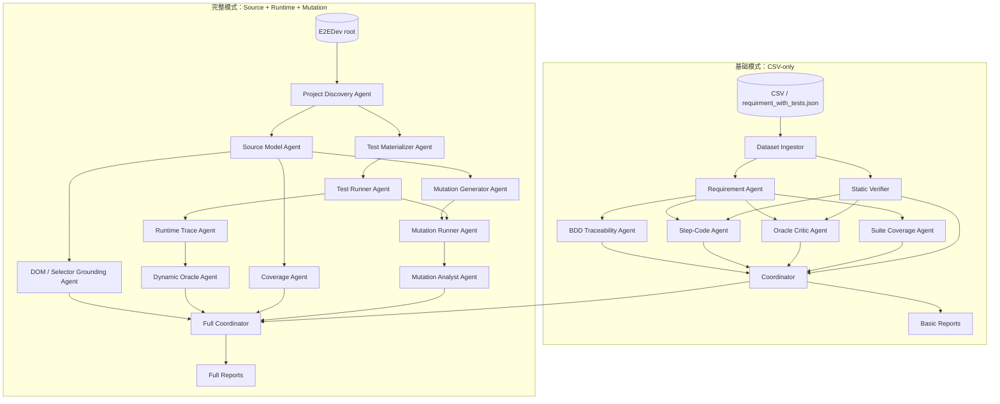
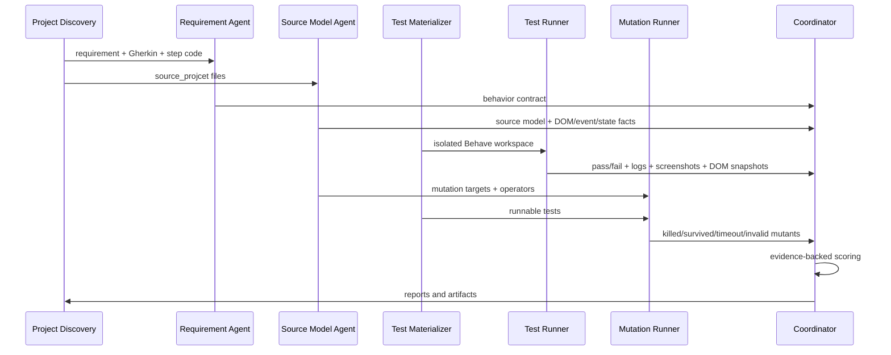
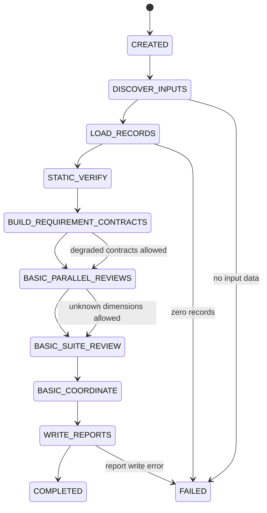
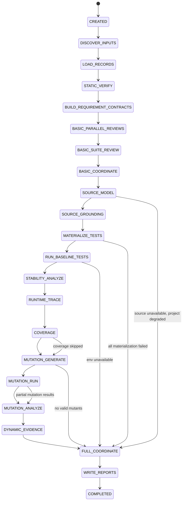
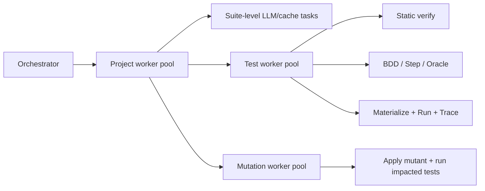

# E2EDev Test Evaluator 完整版项目计划

## 1. 目标

现在完整的 `E2EDev/` 仓库已经 clone 到当前项目中，评估器可以从“只看 CSV 的静态评审器”升级为“两种模式并存”的完整测试质量评估系统：

1. **基础模式（basic / CSV-only）**：沿用当前已实现版本，只基于 CSV 或 `requirment_with_tests.json` 中的需求、Gherkin 场景和 Behave/Selenium 步骤代码做静态与语义评估。
2. **完整模式（full / source-aware + execution + mutation）**：额外读取每个 benchmark 的应用源码，实际运行测试，采集执行结果、运行轨迹、覆盖信息，并执行 mutation testing，用真实的 fault-detection 信号评估测试质量。

核心目标不是简单回答“测试 pass 了吗”，而是回答：

- 测试是否表达了需求？
- 测试步骤是否真的执行了 Gherkin 承诺的动作？
- 测试 oracle 是否验证了需求的关键结果？
- 测试在真实应用上是否能稳定运行？
- 测试能否杀死与需求相关的源码 mutant？
- 同一个 requirement suite 是否覆盖 normal / edge / error / persistence / external integration 等行为空间？

## 2. 当前仓库状态

当前实现版本为 `1.0.0`，Phase 0–10 已全部落地：

- basic：CSV / JSONL / project JSON ingestion、静态检查、OpenAI semantic agents、基础评分。
- full：source model、selector grounding、隔离 materialization、Behave/Selenium baseline、Runtime Trace。
- 可选 `--coverage`：Chrome DevTools precise coverage。
- 可选 `--mutation`：有限 JS/HTML mutation operators、执行、分析和 test/requirement/project 聚合。
- full coordinator：按第 8 节权重计算完整分数，并执行 hard gates；证据不足时保持 `N/A`。
- checkpoint/resume、输入 hash、项目/需求/测试筛选、并发 browser workers 和分层报告。
- mutation 精度增强：补齐 event handler / external API / selector-storage
  string operators，按 behavior contract 选择 impacted tests，并在互不污染的
  disposable workspace 中按 `--workers` 并发执行 mutant。
- 动态证据反馈：新增 `DYNAMIC_EVIDENCE` checkpoint state，将 runtime、oracle
  selector grounding 和 mutation outcomes 回填到 test/requirement 两层报告；该层
  只做解释与风险证据，不重复加入评分权重。
- 覆盖率与浏览器可观测性：external JS 使用 Istanbul，inline script 自动回退
  CDP；采集 storage、network、browser API trace，并支持显式 opt-in stubs。
- 全量稳定性：重复运行 flaky 判定、runtime/mutation 软预算、实时进度、stage
  cost、跨运行历史趋势和 `--max-tests-per-project` 已接入。

真实浏览器执行仍要求环境安装 Behave、Selenium 和 Chrome/Chromium；环境缺失会输出 `env_error`，不会算作测试断言失败。

当前代码结构：

```text
src/test_evaluator/
  ingest.py             # CSV 读取与 requirement suite 分组
  static_verifier.py    # Gherkin / Python / Selenium 静态事实抽取
  agents.py             # Requirement, BDD, Step-Code, Oracle, Suite agents
  evidence.py           # evidence-backed finding 校验
  scoring.py            # deterministic coordinator 与分数聚合
  reporting.py          # evaluation.json / summary.md
  orchestrator.py       # 固定 multi-agent pipeline
  source_model.py       # HTML/JS source model
  grounding.py          # selector/source grounding
  materializer.py       # 隔离 Behave workspace
  runner.py             # baseline browser runner
  runtime_trace.py      # runtime failure classification
  coverage.py           # optional CDP coverage
  mutation/             # operators / generator / runner / analyzer
  cli.py                # 命令行入口
```

完整 E2EDev 数据已经在：

```text
E2EDev/
  E2EDev_data/
    E2EDev_data.csv
    E2EDev_data.jsonl
    E2ESD_Bench_01/
      requirment_with_tests.json
      prompt.txt
      source_projcet/
        index.html
        requirements.json
        web_application_analysis.json
    ...
  E2EDev_data_withTestID/
  run_behave_test.py
  Metrics/
```

注意：E2EDev 数据里的源码目录实际叫 `source_projcet`，不是 `source_project`。实现时应兼容这个拼写，也可以同时探测 `source_project` / `source_code`，避免被目录名绊倒。

## 3. 两种运行模式

### 3.1 基础模式：CSV-only evaluator

基础模式是当前版本的自然延续，输入可以是：

- `e2edev_sample.csv`
- `E2EDev/E2EDev_data/E2EDev_data.csv`
- 之后扩展支持每个项目的 `requirment_with_tests.json`

基础模式只使用这些字段：

| 数据 | 用途 |
|---|---|
| requirement summary / fine-grained requirement | 构建行为契约 |
| Gherkin scenario | 检查需求到 BDD 的可追溯性 |
| Behave step code | 检查 BDD 到代码的可追溯性、oracle 与 robustness |
| project / req / test id | 聚合到 test、requirement suite、project |

基础模式可以给出：

- Test Quality Score
- Requirement Adequacy Score
- BDD traceability findings
- Step-code traceability findings
- Oracle quality findings
- Static robustness findings
- Suite coverage findings
- 静态 mutation readiness / mutation hypothesis

基础模式不能声称：

- 测试真实通过率
- 浏览器执行稳定性
- JS/DOM 代码覆盖率
- 真实 mutation score
- 被测应用源码是否真的实现了需求

基础模式适合：

- 快速扫全量数据
- 控制 API 成本
- 在没有 Chrome / ChromeDriver / Node 环境时做离线分析
- 先定位明显的 oracle gap、placeholder、不可追溯步骤

建议命令形态：

```bash
python -m test_evaluator.cli \
  --mode basic \
  --input E2EDev/E2EDev_data/E2EDev_data.csv \
  --output reports/basic-full-dataset \
  --live
```

短 smoke run：

```bash
python -m test_evaluator.cli \
  --mode basic \
  --input e2edev_sample.csv \
  --output reports/basic-smoke \
  --live \
  --limit 5
```

### 3.2 完整模式：source-aware + execution + mutation evaluator

完整模式以 `E2EDev/` 仓库为输入，同时读取：

| 数据 | 用途 |
|---|---|
| `requirment_with_tests.json` | 权威需求、Gherkin、step code |
| `source_projcet/` | 被测 Web 应用源码 |
| `requirements.json` | 应用级需求摘要与结构化需求 |
| `web_application_analysis.json` | 应用类别、交互模式、技术点 |
| HTML / JS / CSS / assets | DOM、事件、状态、外部 API 与 mutation target |
| Behave execution result | 测试是否真实可运行 |
| console log / screenshot / DOM snapshot | runtime evidence |
| coverage / mutation result | fault-detection signal |

完整模式新增能力：

- 构建源码模型：DOM 元素、`data-testid`、事件监听器、状态变量、localStorage、外部 API、业务逻辑函数。
- 将 JSON/CSV 中的测试物化为真实 Behave 项目。
- 修正测试代码里的 `file://index.html`、`file_path = "index.html"` 等路径，让测试指向隔离 workspace 中的 HTML。
- 使用 headless Chrome 运行测试。
- 捕获 stdout/stderr、Behave JSON、console logs、screenshots、DOM snapshots。
- 对 JS/HTML 中的行为逻辑做 mutation testing。
- 将 survived mutants 反向映射到 requirement behavior，指出“哪些需求行为没有被测试杀死”。

建议命令形态：

```bash
python -m test_evaluator.cli \
  --mode full \
  --e2edev-root E2EDev \
  --projects E2ESD_Bench_01 \
  --output reports/full-smoke \
  --live \
  --mutation \
  --max-mutants 30
```

全量但限流：

```bash
python -m test_evaluator.cli \
  --mode full \
  --e2edev-root E2EDev \
  --output reports/full-all \
  --live \
  --mutation \
  --max-mutants-per-project 50 \
  --workers 2
```

## 4. Multi-agent system 总体结构

### 4.1 双模式总览



### 4.2 完整模式内部流水线



## 5. Agent 设计

### 5.1 Dataset Ingestor / Project Discovery Agent

类型：确定性代码，非 LLM。

职责：

- 读取 CSV、JSONL、`requirment_with_tests.json`。
- 统一转换为内部 `TestRecord`。
- 找到每个项目的源码目录。
- 兼容 `source_projcet`、`source_project`、`source_code`。
- 建立 project / requirement / test 的层级关系。
- 识别项目入口 HTML。
- 收集静态资源列表。

输出：

```json
{
  "project_id": "E2ESD_Bench_01",
  "project_root": "E2EDev/E2EDev_data/E2ESD_Bench_01",
  "source_root": "E2EDev/E2EDev_data/E2ESD_Bench_01/source_projcet",
  "entry_html": "index.html",
  "requirements_file": "source_projcet/requirements.json",
  "tests_file": "requirment_with_tests.json",
  "test_count": 14,
  "requirement_count": 3
}
```

### 5.2 Static Verifier

类型：确定性代码，已基本实现。

职责：

- Python AST parse。
- Gherkin step 抽取。
- Behave decorator 抽取。
- Selenium action 抽取。
- assertion 抽取。
- placeholder / `assert True` / trivial assertion 检测。
- `data-testid`、CSS selector、id、class 引用抽取。
- wait / sleep / teardown 检测。

完整版需要扩展：

- 检测 `context.driver.get(f"file://index.html")` 这类不可移植路径。
- 检测重复 step 函数名、重复 decorator、shadowed step definition。
- 检测测试中是否直接 mock/构造了事件但没有触发真实用户路径。
- 检测测试是否在 `Then` 中关闭浏览器，影响后续 step。

### 5.3 Requirement Agent

类型：LLM + evidence validation。

职责：

- 从 fine-grained requirement 和 `requirements.json` 中抽取行为契约。
- 拆分 normal、edge、error、persistence、external integration。
- 标注每个行为的可观察通道：DOM、storage、browser API、network、canvas、audio、unknown。
- 给后续 oracle、source grounding、mutation 提供行为锚点。

重要约束：

- 不读取候选测试的评分。
- 不因为测试写了某个断言就反推需求。
- 每个 behavior 必须有需求文本证据。

### 5.4 BDD Traceability Agent

类型：LLM + deterministic evidence check。

职责：

- 判断 Gherkin 场景是否覆盖 behavior contract。
- 检查 Given / When / Then 是否分别表达前置条件、用户动作、预期结果。
- 标记 scenario type 是否合理：Normal / Edge / Error。
- 检查场景是否只是换数据但不增加行为覆盖。

输出维度：

- `spec_alignment`
- behavior-to-scenario mapping
- missing / extra / misleading scenario claims

### 5.5 Step-Code Agent

类型：LLM + static facts。

职责：

- 判断 Gherkin 中每个 step 是否有对应 Behave decorator。
- 判断 step code 是否真的执行了 step 所描述的用户动作。
- 检查 selector 是否来自需求或源码。
- 检查 Selenium 操作是否真实触发 UI 行为，而不是只读 DOM 或人工构造结果。

完整模式新增：

- 使用 Source Model Agent 的 DOM/selector facts，判断测试 selector 是否存在。
- 使用 Runtime Trace Agent 的执行日志，判断 step 是否实际被运行。

### 5.6 Oracle Critic Agent

类型：LLM + static/runtime evidence。

职责：

- 判断测试是否有自动 oracle。
- 判断 oracle 是否验证了需求关键结果，而不是验证前置条件。
- 标记弱 oracle：
  - `assert True`
  - 只检查元素存在
  - 只检查输入值而非输出状态
  - 只检查静态文案
  - 使用 print 代替 assert
  - 手动构造事件数据然后断言自己构造的数据

完整模式新增：

- 结合 runtime DOM snapshot 和 console logs，判断断言是否观测到了真实应用状态。
- 对 mutation survived 的区域追加 oracle gap 解释。

### 5.7 Suite Coverage Agent

类型：LLM + deterministic aggregation。

职责：

- 在 requirement suite 层面判断测试集覆盖了哪些 behavior。
- 区分“多条测试重复验证同一行为”和“覆盖不同边界”。
- 输出 suite-level missing behavior。
- 聚合 Normal / Edge / Error 分布。

完整模式新增：

- 使用 runtime pass/fail 和 mutation results 更新 behavior coverage。
- 如果某个 behavior 的所有相关 mutant 都 survived，应降低该 behavior 的 covered 置信度。

### 5.8 Source Model Agent

类型：确定性分析优先，LLM 做语义补充。

职责：

- 读取 HTML / JS / CSS。
- 抽取 DOM 结构。
- 抽取 `data-testid`、id、class、name、role、文本锚点。
- 抽取事件监听器：click、input、change、dragstart、drop、submit、keydown 等。
- 抽取状态读写：localStorage、sessionStorage、global variables、arrays、objects。
- 抽取外部 API：fetch、speechSynthesis、Audio、canvas、geolocation 等。
- 建立 requirement behavior 到源码区域的候选映射。

输出示例：

```json
{
  "project_id": "E2ESD_Bench_01",
  "entry_html": "index.html",
  "dom_anchors": [
    {"selector": "[data-testid='product-item-1']", "tag": "li", "attributes": {"draggable": "true"}},
    {"selector": "#allMoney", "tag": "div"}
  ],
  "event_handlers": [
    {"event": "dragstart", "selector": "li[draggable=true]", "file": "index.html", "line": 81},
    {"event": "drop", "selector": "#div1", "file": "index.html", "line": 95}
  ],
  "state_effects": [
    {"kind": "dom_update", "target": "#div1 .box2"},
    {"kind": "calculation", "target": "#allMoney"}
  ]
}
```

### 5.9 DOM / Selector Grounding Agent

类型：确定性 + LLM。

职责：

- 检查测试引用的 selector 是否在源码中存在。
- 检查需求提到的 UI anchor 是否在源码中存在。
- 识别 brittle selector：
  - 深层 CSS 路径
  - 纯 class 且 class 只用于样式
  - 文本匹配过宽
  - index-based selector
- 判断测试是否绕过了真实用户可见 UI。

输出：

- selector existence
- selector stability score
- requirement/source/test 三方映射

### 5.10 Test Materializer Agent

类型：确定性代码。

职责：

- 为每个项目创建隔离运行目录。
- 复制源码和 assets，不修改原始 E2EDev 目录。
- 生成 `features/features.feature`。
- 生成 `features/steps/steps.py`。
- 修正测试代码中硬编码的 `file://index.html` 路径。
- 注入必要的 Behave environment hooks。
- 可选注入 runtime instrumentation。

隔离目录建议：

```text
reports/<run-id>/workspaces/
  E2ESD_Bench_01/
    app/
    features/
      features.feature
      steps/steps.py
    artifacts/
```

### 5.11 Test Runner Agent

类型：确定性代码。

职责：

- 使用 headless Chrome 执行 Behave。
- 设置 timeout。
- 捕获 stdout / stderr。
- 捕获 Behave JSON。
- 失败时保存 screenshot。
- 保存 DOM snapshot。
- 捕获 browser console logs。
- 清理 Chrome / chromedriver 进程。
- 将 flaky / timeout / environment error 与 assertion failure 分开。

输出：

```json
{
  "record_key": "E2ESD_Bench_01::1::1",
  "status": "pass | fail | timeout | env_error",
  "duration_seconds": 4.21,
  "failed_step": "Then the product title ...",
  "error_type": "assertion_failure",
  "stdout_path": "...",
  "screenshot_path": "...",
  "dom_snapshot_path": "...",
  "console_logs": []
}
```

### 5.12 Runtime Trace Agent

类型：确定性采集 + LLM 解释。

职责：

- 从 Behave result、DOM snapshot、console logs 中提取 runtime evidence。
- 判断测试失败是环境问题、路径问题、selector 不存在、应用 bug，还是 oracle 本身有问题。
- 标记 flaky 风险：
  - 大量 `time.sleep`
  - drag/drop JS simulation 与真实浏览器行为不一致
  - 异步 API 没有等待
  - 外部网络依赖没有 mock

### 5.13 Coverage Agent

类型：确定性代码。

职责：

- 在完整模式中采集源码覆盖信息。
- 第一阶段可以使用 Chrome DevTools Protocol 的 JS precise coverage。
- 第二阶段对可分离 JS 文件使用 Istanbul instrumentation，收集 `window.__coverage__`。
- 对 inline script 需要先抽取或动态注入 instrumentation。

注意：

- Coverage 不是最终目标，只作为执行范围信号。
- 高 coverage 不能替代 oracle，也不能替代 mutation score。
- 对于纯 HTML/CSS 行为，coverage 只能作为辅助。

### 5.14 Mutation Generator Agent

类型：确定性 mutator 为主，LLM 辅助选择 high-value operators。

职责：

- 基于 Source Model 和 Requirement Contract 选择 mutation target。
- 只对行为相关源码生成 mutant，避免无意义样式或静态文本制造噪声。
- 生成可回滚 patch。
- 对每个 mutant 记录原始片段、变异片段、文件、行号、operator、关联 behavior。

MVP mutation operators：

| Operator | 例子 | 适合发现的问题 |
|---|---|---|
| Boolean flip | `true` ↔ `false` | 缺少状态断言 |
| Comparison replacement | `>` ↔ `>=`, `===` ↔ `!==` | 边界条件未覆盖 |
| Arithmetic replacement | `+` ↔ `-`, `*` ↔ `/` | 价格、计数、总和错误 |
| Numeric literal replacement | `0` → `1`, `1` → `2` | 数量、阈值、索引错误 |
| String literal replacement | event name / storage key / CSS selector | 事件、存储、选择器 oracle 缺口 |
| Event handler deletion | remove handler body or early return | 测试是否真正触发用户动作 |
| DOM update deletion | skip `appendChild` / `textContent` update | UI 结果是否被验证 |
| API call deletion | skip `speechSynthesis.speak`, `fetch` | 外部 API oracle 是否存在 |

不建议 MVP 一开始做的 mutation：

- CSS layout mutation：容易产生视觉差异但难自动判定。
- 大范围 HTML structure mutation：invalid mutant 太多。
- 随机文本 mutation：很多不对应需求行为。

### 5.15 Mutation Runner Agent

类型：确定性代码。

职责：

- 对每个 mutant 创建临时源码副本。
- 运行受影响的测试。
- 判断 mutant 状态：
  - `killed`：至少一个相关测试失败。
  - `survived`：相关测试全部通过。
  - `timeout`：运行超时。
  - `invalid`：应用无法加载或语法错误。
  - `skipped`：无法安全执行。
- 限制成本：
  - 只跑 impacted tests。
  - 每项目限制最大 mutant 数。
  - 并发 worker 可配置。
  - timeout 可配置。

MVP 不需要直接上 StrykerJS。因为 E2EDev 多数是静态 HTML/JS 项目，测试 runner 是 Behave/Selenium，不是 Jest/Mocha。更稳的路线是先做一个 lightweight JS mutator + Behave runner。后续如果项目有 `package.json` 或标准 JS 测试入口，再接 StrykerJS。

### 5.16 Mutation Analyst Agent

类型：LLM + deterministic aggregation。

职责：

- 解释 survived mutants 代表的测试缺口。
- 将 mutant 映射回 behavior contract。
- 区分：
  - 测试没有执行到该代码。
  - 测试执行到了但没有 oracle。
  - 测试 oracle 太弱。
  - mutant 可能等价。
  - mutant 与需求无关。

输出：

```json
{
  "behavior_id": "REQ-005-B02",
  "mutation_score": 42.9,
  "survived_mutants": [
    {
      "mutant_id": "E2ESD_Bench_01:M17",
      "operator": "arithmetic_replacement",
      "file": "script.js",
      "line": 42,
      "original": "total += price",
      "mutated": "total -= price",
      "interpretation": "Tests did not fail when total price calculation was inverted."
    }
  ],
  "suggested_fix": "Assert exact total after adding multiple products, including repeated products."
}
```

### 5.17 Full Coordinator

类型：确定性评分器。

职责：

- 合并基础模式 findings、源码 grounding、runtime、coverage、mutation。
- 保持 evidence-backed 规则：没有证据的结论不得给 PASS/FAIL。
- 应用 hard gates。
- 生成 test / requirement / project 三层报告。

## 6. Agent 输入/输出 Schema

本节定义后续实现应使用的工程契约。这里的 schema 是 Pydantic / JSON contract 级别的设计，不要求一开始完全实现所有字段，但字段命名和层级建议尽量保持稳定，避免报告、缓存和状态机后续频繁迁移。

### 6.1 Schema 约定

- 所有 agent 输入输出都必须带 `run_id`、`project_id` 或 `record_key`，方便 checkpoint、resume 和 artifact tracing。
- 所有 LLM agent 输出都必须经过 evidence validation；没有证据支撑的 `PASS` / `FAIL` 应降级为 `UNKNOWN`。
- 所有文件路径都使用相对 `output_dir` 的路径写入报告，运行时可解析为绝对路径。
- 基础模式不得输出真实 `mutation_score`、`coverage` 或 `runtime_pass_rate`，只能输出 `mutation_readiness` / `UNKNOWN`。
- 完整模式中，如果某个 full-only agent 失败，应保留 basic 结果，并把 full-only 字段标记为 `UNKNOWN` 或 `degraded`。

### 6.2 公共基础类型

```python
Status = Literal["PASS", "WARNING", "FAIL", "UNKNOWN", "SKIPPED"]
Severity = Literal["info", "minor", "major", "critical"]
Risk = Literal["low", "medium", "major", "critical", "unknown"]
Mode = Literal["basic", "full"]
ArtifactKind = Literal[
    "stdout", "stderr", "behave_json", "screenshot", "dom_snapshot",
    "console_log", "source_model", "coverage", "mutation_result", "workspace"
]
```

```python
class ArtifactRef(BaseModel):
    kind: ArtifactKind
    path: str
    description: str | None = None
    sha256: str | None = None

class Evidence(BaseModel):
    field: str                         # CSV field, source file, runtime artifact, derived fact
    quote: str | None = None           # short excerpt when text evidence exists
    file_path: str | None = None
    line_start: int | None = None
    line_end: int | None = None
    artifact: ArtifactRef | None = None

class Finding(BaseModel):
    criterion: str
    status: Status
    severity: Severity
    confidence: float                  # 0.0 - 1.0
    evidence: list[Evidence]
    reasoning: str
    suggested_fix: str | None = None

class AgentEnvelope(BaseModel):
    agent: str
    run_id: str
    mode: Mode
    project_id: str | None = None
    suite_key: str | None = None
    record_key: str | None = None
    status: Status
    confidence: float
    findings: list[Finding]
    artifacts: list[ArtifactRef] = []
    warnings: list[str] = []
```

### 6.3 数据输入与项目发现 schema

```python
class TestRecord(BaseModel):
    project_id: str
    requirement_id: str
    test_id: str
    record_key: str                    # "{project_id}::{requirement_id}::{test_id}"
    suite_key: str                     # "{project_id}::{requirement_id}"
    requirement_summary: str | None = None
    fine_grained_requirement: str
    scenario: str
    step_code: str
    scenario_type: Literal["Normal", "Edge", "Error", "Unknown"] = "Unknown"
    source_reference: str | None = None
    input_origin: Literal["csv", "jsonl", "requirment_with_tests"] 

class ProjectInventoryInput(BaseModel):
    run_id: str
    mode: Mode
    input_path: str | None = None
    e2edev_root: str | None = None
    selected_projects: list[str] | None = None
    selected_requirements: list[str] | None = None
    selected_tests: list[str] | None = None

class ProjectInventory(BaseModel):
    project_id: str
    project_root: str | None = None
    source_root: str | None = None
    entry_html: str | None = None
    tests_file: str | None = None
    requirements_file: str | None = None
    web_application_analysis_file: str | None = None
    source_files: list[str] = []
    asset_files: list[str] = []
    test_count: int
    requirement_count: int
    discovery_status: Status
    warnings: list[str] = []

class ProjectDiscoveryOutput(BaseModel):
    run_id: str
    mode: Mode
    projects: list[ProjectInventory]
    records: list[TestRecord]
```

Agent contract：

| Agent | 输入 | 输出 |
|---|---|---|
| Dataset Ingestor / Project Discovery | `ProjectInventoryInput` | `ProjectDiscoveryOutput` |

失败策略：

- 找不到任何测试数据：hard fail，运行结束。
- 某个项目找不到源码：basic 模式继续；full 模式对该项目降级为 basic-only。
- `source_projcet` / `source_project` / `source_code` 都不存在：记录 `discovery_status=WARNING`。

### 6.4 Static Verifier schema

```python
class StaticVerifierInput(BaseModel):
    run_id: str
    record: TestRecord

class StaticFacts(BaseModel):
    python_parseable: bool
    syntax_error: str | None = None
    scenario_present: bool
    scenario_type: str | None = None
    gherkin_steps: list[str] = []
    decorators: list[str] = []
    missing_step_definitions: list[str] = []
    duplicate_step_definitions: list[str] = []
    assertion_count: int = 0
    trivial_assertion_count: int = 0
    print_only_oracle_count: int = 0
    requirement_test_ids: list[str] = []
    gherkin_test_ids: list[str] = []
    code_test_ids: list[str] = []
    gherkin_ids_missing_from_code: list[str] = []
    selectors: list[str] = []
    actions: list[str] = []
    webdriver_wait_count: int = 0
    sleep_count: int = 0
    has_driver_quit: bool = False
    hardcoded_file_paths: list[str] = []
    direct_event_construction: list[str] = []

class StaticVerifierOutput(AgentEnvelope):
    agent: Literal["static_verifier"]
    dimension: Literal["robustness"]
    facts: StaticFacts
```

Agent contract：

| Agent | 输入 | 输出 |
|---|---|---|
| Static Verifier | `StaticVerifierInput` | `StaticVerifierOutput` |

失败策略：

- Python parse 失败不是 orchestrator hard fail；输出 `status=FAIL`、`severity=critical`，后续语义 agent 可跳过依赖 AST 的检查。
- Gherkin 缺失 Scenario：该 test 进入 hard gate，但 suite/project 继续。

### 6.5 Requirement Agent schema

```python
class RequirementAgentInput(BaseModel):
    run_id: str
    project_id: str
    requirement_id: str
    suite_key: str
    requirement_summary: str | None = None
    fine_grained_requirement: str
    source_requirements: list[str] = []     # full mode: source_projcet/requirements.json
    web_application_analysis: dict = {}     # full mode optional

class Behavior(BaseModel):
    behavior_id: str
    kind: Literal["normal", "edge", "error", "persistence", "external_integration", "other"]
    preconditions: list[str]
    actor_actions: list[str]
    expected_observables: list[str]
    state_effects: list[str]
    ui_anchors: list[str]
    constraints: list[str]
    observability: Literal["dom", "storage", "browser_api", "network", "canvas", "audio", "unknown"]
    source_evidence: list[Evidence]

class RequirementContract(BaseModel):
    project_id: str
    requirement_id: str
    suite_key: str
    behaviors: list[Behavior]

class RequirementAgentOutput(AgentEnvelope):
    agent: Literal["requirement_agent"]
    contract: RequirementContract
```

Agent contract：

| Agent | 输入 | 输出 |
|---|---|---|
| Requirement Agent | `RequirementAgentInput` | `RequirementAgentOutput` |

失败策略：

- LLM 结构化输出无法解析：重试；仍失败则输出空 `behaviors=[]`，该 suite 的 LLM semantic reviews 降级为 `UNKNOWN`。
- 行为没有 evidence：丢弃该 behavior，不进入后续评分。

### 6.6 BDD Traceability Agent schema

```python
class BDDTraceabilityInput(BaseModel):
    run_id: str
    record: TestRecord
    contract: RequirementContract
    static_facts: StaticFacts

class BehaviorScenarioMapping(BaseModel):
    behavior_id: str
    gherkin_steps: list[str]
    coverage_status: Status
    evidence: list[Evidence]

class BDDTraceabilityOutput(AgentEnvelope):
    agent: Literal["bdd_traceability"]
    dimension: Literal["spec_alignment"]
    behavior_mappings: list[BehaviorScenarioMapping]
    missing_behaviors: list[str] = []
    unsupported_scenario_claims: list[str] = []
```

Agent contract：

| Agent | 输入 | 输出 |
|---|---|---|
| BDD Traceability Agent | `BDDTraceabilityInput` | `BDDTraceabilityOutput` |

失败策略：

- Requirement contract 为空：直接 `SKIPPED`。
- 输出中的 Gherkin evidence 不在 scenario 原文中：对应 finding 降级为 `UNKNOWN`。

### 6.7 Step-Code Agent schema

```python
class StepCodeInput(BaseModel):
    run_id: str
    record: TestRecord
    contract: RequirementContract
    static_facts: StaticFacts
    source_model: "SourceModel | None" = None
    runtime_result: "RuntimeResult | None" = None

class StepImplementationMapping(BaseModel):
    gherkin_step: str
    decorator: str | None
    function_name: str | None
    implementation_status: Status
    action_observed: bool | None = None
    selectors_used: list[str] = []
    evidence: list[Evidence]

class StepCodeOutput(AgentEnvelope):
    agent: Literal["step_code"]
    dimension: Literal["step_traceability"]
    step_mappings: list[StepImplementationMapping]
    missing_steps: list[str] = []
    misleading_steps: list[str] = []
```

Agent contract：

| Agent | 输入 | 输出 |
|---|---|---|
| Step-Code Agent | `StepCodeInput` | `StepCodeOutput` |

失败策略：

- Static Verifier 已发现 Python parse 失败：Step-Code Agent 可以跳过 LLM 调用，直接输出 `FAIL`。
- full mode 中 runtime 未执行：仍可基于静态证据给出 basic step review，但 `action_observed=None`。

### 6.8 Oracle Critic Agent schema

```python
class OracleCriticInput(BaseModel):
    run_id: str
    record: TestRecord
    contract: RequirementContract
    static_facts: StaticFacts
    source_model: "SourceModel | None" = None
    runtime_trace: "RuntimeTrace | None" = None
    mutation_analysis: "MutationAnalysis | None" = None

class OracleCheck(BaseModel):
    behavior_id: str
    expected_observable: str
    observed_by_test: bool
    oracle_type: Literal[
        "assert_dom", "assert_storage", "assert_browser_api", "assert_network",
        "assert_calculation", "assert_exception", "print_only", "placeholder", "none", "unknown"
    ]
    strength: Literal["strong", "medium", "weak", "none", "unknown"]
    evidence: list[Evidence]

class OracleCriticOutput(AgentEnvelope):
    agent: Literal["oracle_critic"]
    dimension: Literal["oracle_strength"]
    oracle_checks: list[OracleCheck]
    critical_oracle_gaps: list[str] = []
```

Agent contract：

| Agent | 输入 | 输出 |
|---|---|---|
| Oracle Critic Agent | `OracleCriticInput` | `OracleCriticOutput` |

失败策略：

- 如果只有 `assert True` 或 print：不需要 LLM 即可输出 critical finding。
- 如果 runtime/mutation 缺失：不要推断动态 oracle，只输出静态 oracle 判断。

### 6.9 Suite Coverage Agent schema

```python
class SuiteCoverageInput(BaseModel):
    run_id: str
    suite_key: str
    project_id: str
    requirement_id: str
    contract: RequirementContract
    records: list[TestRecord]
    test_reviews: list[AgentEnvelope]
    runtime_results: list["RuntimeResult"] = []
    mutation_analysis: list["MutationAnalysis"] = []

class BehaviorCoverage(BaseModel):
    behavior_id: str
    status: Status
    covered_by_records: list[str] = []
    runtime_confirmed_by_records: list[str] = []
    killed_by_mutants: list[str] = []
    survived_mutants: list[str] = []
    evidence: list[Evidence] = []

class SuiteCoverageOutput(AgentEnvelope):
    agent: Literal["suite_coverage"]
    dimension: Literal["suite_adequacy"]
    behavior_coverage: list[BehaviorCoverage]
    scenario_distribution: dict[str, int]
    duplicate_scenarios: list[list[str]] = []
    missing_behavior_ids: list[str] = []
```

Agent contract：

| Agent | 输入 | 输出 |
|---|---|---|
| Suite Coverage Agent | `SuiteCoverageInput` | `SuiteCoverageOutput` |

失败策略：

- 单个 test review 失败不阻塞 suite review；该 test 的对应维度按 `UNKNOWN` 计。
- full mode 如果 mutation 失败，suite coverage 仍可使用 basic + runtime 证据。

### 6.10 Source Model Agent schema

```python
class SourceModelInput(BaseModel):
    run_id: str
    inventory: ProjectInventory
    contract_by_suite: dict[str, RequirementContract] = {}

class DomAnchor(BaseModel):
    selector: str
    tag: str
    text: str | None = None
    attributes: dict[str, str] = {}
    file_path: str
    line_start: int | None = None

class EventHandler(BaseModel):
    event: str
    selector: str | None = None
    function_name: str | None = None
    file_path: str
    line_start: int | None = None
    behavior_candidates: list[str] = []

class StateEffect(BaseModel):
    kind: Literal["dom_update", "storage_write", "storage_read", "calculation", "api_call", "navigation", "unknown"]
    target: str
    file_path: str
    line_start: int | None = None
    behavior_candidates: list[str] = []

class SourceModel(BaseModel):
    project_id: str
    source_root: str
    entry_html: str | None
    dom_anchors: list[DomAnchor]
    event_handlers: list[EventHandler]
    state_effects: list[StateEffect]
    external_apis: list[str] = []
    source_files: list[str] = []
    parse_warnings: list[str] = []

class SourceModelOutput(AgentEnvelope):
    agent: Literal["source_model"]
    source_model: SourceModel
```

Agent contract：

| Agent | 输入 | 输出 |
|---|---|---|
| Source Model Agent | `SourceModelInput` | `SourceModelOutput` |

失败策略：

- HTML 找不到：full mode 项目降级为 basic-only。
- JS parse 失败：保留 HTML/selector facts，JS 行为 facts 标记为 partial。

### 6.11 DOM / Selector Grounding Agent schema

```python
class SelectorGroundingInput(BaseModel):
    run_id: str
    record: TestRecord
    contract: RequirementContract
    static_facts: StaticFacts
    source_model: SourceModel

class SelectorGroundingItem(BaseModel):
    selector: str
    source_exists: bool
    matched_anchors: list[DomAnchor] = []
    stability: Literal["stable", "medium", "brittle", "unknown"]
    purpose: Literal["precondition", "action_target", "oracle_target", "unknown"]
    evidence: list[Evidence]

class SelectorGroundingOutput(AgentEnvelope):
    agent: Literal["selector_grounding"]
    dimension: Literal["source_grounding"]
    selectors: list[SelectorGroundingItem]
    missing_source_anchors: list[str] = []
```

Agent contract：

| Agent | 输入 | 输出 |
|---|---|---|
| DOM / Selector Grounding Agent | `SelectorGroundingInput` | `SelectorGroundingOutput` |

失败策略：

- Source Model 缺失：`SKIPPED`。
- 某 selector 无法静态确认但 runtime 能找到：标记 `WARNING` 而不是 `FAIL`。

### 6.12 Test Materializer Agent schema

```python
class TestMaterializerInput(BaseModel):
    run_id: str
    inventory: ProjectInventory
    record: TestRecord
    output_dir: str
    instrumentation: dict = {}

class WorkspaceSpec(BaseModel):
    record_key: str
    workspace_root: str
    app_root: str
    feature_file: str
    steps_file: str
    entry_html: str
    artifacts_dir: str
    rewritten_paths: list[dict] = []

class TestMaterializerOutput(AgentEnvelope):
    agent: Literal["test_materializer"]
    workspace: WorkspaceSpec
```

Agent contract：

| Agent | 输入 | 输出 |
|---|---|---|
| Test Materializer Agent | `TestMaterializerInput` | `TestMaterializerOutput` |

失败策略：

- 无法写 workspace：hard fail 当前 test，但不影响其他 test。
- path rewrite 不确定：保留 warning，并让 runner 尝试执行。

### 6.13 Test Runner Agent schema

```python
class TestRunnerInput(BaseModel):
    run_id: str
    workspace: WorkspaceSpec
    timeout_seconds: float
    headless: bool = True
    retry_index: int = 0

class RuntimeResult(BaseModel):
    record_key: str
    status: Literal["pass", "fail", "timeout", "env_error", "skipped"]
    duration_seconds: float | None = None
    failed_step: str | None = None
    error_type: Literal[
        "assertion_failure", "selector_not_found", "syntax_error", "browser_error",
        "path_error", "timeout", "env_error", "unknown"
    ] | None = None
    stdout: ArtifactRef | None = None
    stderr: ArtifactRef | None = None
    behave_json: ArtifactRef | None = None
    screenshot: ArtifactRef | None = None
    dom_snapshot: ArtifactRef | None = None
    console_log: ArtifactRef | None = None

class TestRunnerOutput(AgentEnvelope):
    agent: Literal["test_runner"]
    runtime: RuntimeResult
```

Agent contract：

| Agent | 输入 | 输出 |
|---|---|---|
| Test Runner Agent | `TestRunnerInput` | `TestRunnerOutput` |

失败策略：

- `env_error` 可重试一次。
- assertion failure 不重试，直接进入 Runtime Trace。
- timeout 可按配置重试一次；第二次仍 timeout 则标记 flaky/high risk。

### 6.14 Runtime Trace Agent schema

```python
class RuntimeTraceInput(BaseModel):
    run_id: str
    record: TestRecord
    runtime: RuntimeResult
    static_facts: StaticFacts
    source_model: SourceModel | None = None

class RuntimeObservation(BaseModel):
    kind: Literal["step_result", "dom_state", "console", "screenshot", "exception", "timing"]
    summary: str
    evidence: list[Evidence]

class RuntimeTrace(BaseModel):
    record_key: str
    execution_status: RuntimeResult
    observations: list[RuntimeObservation]
    likely_failure_cause: Literal[
        "test_bug", "app_bug", "oracle_mismatch", "selector_issue",
        "path_issue", "environment_issue", "timeout_or_flaky", "unknown"
    ]
    flaky_risk: Literal["low", "medium", "high", "unknown"]

class RuntimeTraceOutput(AgentEnvelope):
    agent: Literal["runtime_trace"]
    runtime_trace: RuntimeTrace
```

Agent contract：

| Agent | 输入 | 输出 |
|---|---|---|
| Runtime Trace Agent | `RuntimeTraceInput` | `RuntimeTraceOutput` |

失败策略：

- 没有 DOM snapshot / screenshot 时仍可基于 stdout/stderr 解释。
- 解释失败不阻塞 full scoring；runtime status 仍可直接进入评分。

### 6.15 Coverage Agent schema

```python
class CoverageInput(BaseModel):
    run_id: str
    inventory: ProjectInventory
    workspace: WorkspaceSpec
    runtime: RuntimeResult
    method: Literal["cdp_precise_coverage", "istanbul", "none"]

class FileCoverage(BaseModel):
    file_path: str
    statement_coverage: float | None = None
    branch_coverage: float | None = None
    function_coverage: float | None = None
    executed_ranges: list[dict] = []

class CoverageReport(BaseModel):
    project_id: str
    record_key: str
    method: str
    status: Status
    files: list[FileCoverage]
    artifacts: list[ArtifactRef] = []

class CoverageOutput(AgentEnvelope):
    agent: Literal["coverage"]
    coverage: CoverageReport
```

Agent contract：

| Agent | 输入 | 输出 |
|---|---|---|
| Coverage Agent | `CoverageInput` | `CoverageOutput` |

失败策略：

- Coverage 采集失败不影响 runtime 或 mutation；标记 `UNKNOWN`。
- 基础模式永远不调用 Coverage Agent。

### 6.16 Mutation Generator / Runner / Analyst schema

```python
class MutationGeneratorInput(BaseModel):
    run_id: str
    inventory: ProjectInventory
    source_model: SourceModel
    contracts: list[RequirementContract]
    max_mutants: int
    operators: list[str] = []

class MutantSpec(BaseModel):
    mutant_id: str
    project_id: str
    operator: str
    file_path: str
    line_start: int | None = None
    original: str
    mutated: str
    behavior_candidates: list[str] = []
    impacted_record_keys: list[str] = []
    suspected_equivalent: bool = False

class MutationPlan(BaseModel):
    project_id: str
    mutants: list[MutantSpec]
    skipped_candidates: list[dict] = []

class MutationGeneratorOutput(AgentEnvelope):
    agent: Literal["mutation_generator"]
    plan: MutationPlan

class MutationRunnerInput(BaseModel):
    run_id: str
    mutant: MutantSpec
    base_workspace_root: str
    tests_to_run: list[TestRecord]
    timeout_seconds: float

class MutationRunResult(BaseModel):
    mutant_id: str
    status: Literal["killed", "survived", "timeout", "invalid", "skipped"]
    killed_by_record_keys: list[str] = []
    survived_record_keys: list[str] = []
    runtime_artifacts: list[ArtifactRef] = []
    error_summary: str | None = None

class MutationRunnerOutput(AgentEnvelope):
    agent: Literal["mutation_runner"]
    result: MutationRunResult

class MutationAnalystInput(BaseModel):
    run_id: str
    project_id: str
    contract_by_suite: dict[str, RequirementContract]
    source_model: SourceModel
    mutation_plan: MutationPlan
    mutation_results: list[MutationRunResult]
    test_reviews: list[AgentEnvelope]

class MutationBehaviorSummary(BaseModel):
    behavior_id: str
    total_mutants: int
    killed: int
    survived: int
    timeout: int
    invalid: int
    mutation_score: float | None
    survived_mutants: list[str] = []
    suspected_equivalent_mutants: list[str] = []
    interpretation: str

class MutationAnalysis(BaseModel):
    project_id: str
    mutation_score: float | None
    behavior_summaries: list[MutationBehaviorSummary]
    top_survived_mutants: list[MutantSpec] = []

class MutationAnalystOutput(AgentEnvelope):
    agent: Literal["mutation_analyst"]
    analysis: MutationAnalysis
```

Agent contract：

| Agent | 输入 | 输出 |
|---|---|---|
| Mutation Generator Agent | `MutationGeneratorInput` | `MutationGeneratorOutput` |
| Mutation Runner Agent | `MutationRunnerInput` | `MutationRunnerOutput` |
| Mutation Analyst Agent | `MutationAnalystInput` | `MutationAnalystOutput` |

失败策略：

- Mutation Generator 生成 0 个 mutant：full 模式继续，mutation 字段为 `UNKNOWN`。
- 单个 mutant invalid 不影响其他 mutant。
- Mutation Runner 超时：该 mutant 记为 `timeout`，不重试超过配置上限。
- Mutation Analyst 失败：报告保留 raw mutation results，解释字段为 `UNKNOWN`。

### 6.17 Coordinator 输出 schema

```python
class DimensionScores(BaseModel):
    spec_alignment: float | None = None
    step_traceability: float | None = None
    oracle_strength: float | None = None
    robustness: float | None = None
    source_grounding: float | None = None
    runtime_result: float | None = None
    coverage: float | None = None
    mutation_effectiveness: float | None = None

class TestReport(BaseModel):
    record_key: str
    project_id: str
    requirement_id: str
    test_id: str
    scenario_type: str | None = None
    mode: Mode
    basic_test_quality_score: float | None = None
    full_test_quality_score: float | None = None
    dimension_scores: DimensionScores
    confidence_coverage: float
    risk: Risk
    hard_gates: list[str] = []
    runtime: RuntimeResult | None = None
    mutation_score: float | None = None
    reviews: list[AgentEnvelope] = []

class RequirementReport(BaseModel):
    suite_key: str
    project_id: str
    requirement_id: str
    mode: Mode
    test_count: int
    scenario_distribution: dict[str, int]
    basic_requirement_adequacy_score: float | None = None
    full_requirement_adequacy_score: float | None = None
    behavior_coverage: list[BehaviorCoverage]
    runtime_pass_rate: float | None = None
    mutation_score: float | None = None
    risk: Risk

class ProjectReport(BaseModel):
    project_id: str
    mode: Mode
    test_count: int
    requirement_count: int
    average_basic_test_quality_score: float | None = None
    average_full_test_quality_score: float | None = None
    average_requirement_adequacy_score: float | None = None
    runtime_pass_rate: float | None = None
    mutation_score: float | None = None
    risk_counts: dict[str, int]
    unknown_rate: float

class EvaluationRun(BaseModel):
    run_id: str
    mode: Mode
    model: str | None = None
    config: dict
    tests: list[TestReport]
    requirements: list[RequirementReport]
    projects: list[ProjectReport]
    runtime_warnings: list[str] = []
    artifacts: list[ArtifactRef] = []
```

Agent contract：

| Agent | 输入 | 输出 |
|---|---|---|
| Basic Coordinator | static / requirement / BDD / step / oracle / suite outputs | `EvaluationRun` with basic fields |
| Full Coordinator | basic outputs + source / runtime / coverage / mutation outputs | `EvaluationRun` with full fields |

## 7. Orchestrator 状态机与失败恢复

### 7.1 状态模型

Orchestrator 不应该是一个“长函数一路跑到底”，而应该是可 checkpoint、可 resume 的状态机。每个 state 输入来自上一个 state 的 artifact 或缓存；每个 state 完成后写入 manifest。

```python
OrchestratorState = Literal[
    "CREATED",
    "DISCOVER_INPUTS",
    "LOAD_RECORDS",
    "STATIC_VERIFY",
    "BUILD_REQUIREMENT_CONTRACTS",
    "BASIC_PARALLEL_REVIEWS",
    "BASIC_SUITE_REVIEW",
    "BASIC_COORDINATE",
    "SOURCE_MODEL",
    "SOURCE_GROUNDING",
    "MATERIALIZE_TESTS",
    "RUN_BASELINE_TESTS",
    "STABILITY_ANALYZE",
    "RUNTIME_TRACE",
    "COVERAGE",
    "MUTATION_GENERATE",
    "MUTATION_RUN",
    "MUTATION_ANALYZE",
    "DYNAMIC_EVIDENCE",
    "FULL_COORDINATE",
    "WRITE_REPORTS",
    "COMPLETED",
    "FAILED"
]

StateStatus = Literal["pending", "running", "succeeded", "failed", "skipped", "degraded", "retrying", "cached"]

class StateCheckpoint(BaseModel):
    run_id: str
    state: OrchestratorState
    status: StateStatus
    started_at: str | None = None
    finished_at: str | None = None
    attempts: int = 0
    input_hash: str | None = None
    output_artifacts: list[ArtifactRef] = []
    error_summary: str | None = None
    recoverable: bool = True

class RunManifest(BaseModel):
    run_id: str
    mode: Mode
    output_dir: str
    config_hash: str
    current_state: OrchestratorState
    checkpoints: list[StateCheckpoint]
    project_status: dict[str, StateStatus] = {}
    record_status: dict[str, StateStatus] = {}
    mutant_status: dict[str, StateStatus] = {}
```

manifest 建议路径：

```text
reports/<run-id>/
  run_manifest.json
  checkpoints/
    01_project_discovery.json
    02_records.json
    03_static_facts.json
    ...
```

### 7.2 基础模式状态机



基础模式关键点：

- `STATIC_VERIFY` 对每个 test 独立执行；单个 test 失败不会中断整个 run。
- `BUILD_REQUIREMENT_CONTRACTS` 按 suite 执行；某个 suite 的 LLM 失败只降级该 suite。
- `BASIC_PARALLEL_REVIEWS` 中 BDD、Step-Code、Oracle 可以并行；某个 agent 失败只影响对应维度。

### 7.3 完整模式状态机



完整模式关键点：

- 完整模式先跑 basic pipeline，再叠加 full-only evidence。这样 full-only 失败时仍能产出可用报告。
- `SOURCE_MODEL` 是项目级 state；`MATERIALIZE_TESTS`、`RUN_BASELINE_TESTS`、`RUNTIME_TRACE` 是 test 级 state；`MUTATION_RUN` 是 mutant 级 state。
- `COVERAGE` 是可选 state，默认不作为 hard dependency。
- `MUTATION_GENERATE` 依赖 Source Model；如果 Source Model 降级，mutation 自动跳过。

### 7.4 状态转移表

| State | 粒度 | 主要输入 | 主要输出 | 可恢复失败 |
|---|---|---|---|---|
| `DISCOVER_INPUTS` | run/project | CLI config | `ProjectDiscoveryOutput` | 部分项目找不到源码 |
| `LOAD_RECORDS` | run | CSV/JSON | `TestRecord[]` | 单条记录格式异常 |
| `STATIC_VERIFY` | test | `TestRecord` | `StaticFacts` | Python parse fail |
| `BUILD_REQUIREMENT_CONTRACTS` | suite | requirement text | `RequirementContract` | LLM fail / empty contract |
| `BASIC_PARALLEL_REVIEWS` | test | record + contract + static facts | BDD / Step / Oracle outputs | 单 agent fail |
| `BASIC_SUITE_REVIEW` | suite | test reviews | `SuiteCoverageOutput` | suite agent fail |
| `BASIC_COORDINATE` | run | basic outputs | basic scores | unknown dimensions |
| `SOURCE_MODEL` | project | source files | `SourceModel` | JS parse partial |
| `SOURCE_GROUNDING` | test | source model + selectors | selector grounding | source model partial |
| `MATERIALIZE_TESTS` | test | source + test | `WorkspaceSpec` | single test materialization fail |
| `RUN_BASELINE_TESTS` | test | workspace | `RuntimeResult` | env_error / timeout |
| `STABILITY_ANALYZE` | test | repeated unchanged runtime | `StabilityReport` | partial repeats |
| `RUNTIME_TRACE` | test | runtime artifacts | `RuntimeTrace` | missing screenshot / DOM |
| `COVERAGE` | test/project | runtime + instrumentation | `CoverageReport` | coverage unavailable |
| `MUTATION_GENERATE` | project | source model + contracts | `MutationPlan` | no valid targets |
| `MUTATION_RUN` | mutant | mutant + impacted tests | `MutationRunResult` | invalid / timeout mutant |
| `MUTATION_ANALYZE` | project | mutation results | `MutationAnalysis` | analyst LLM fail |
| `DYNAMIC_EVIDENCE` | test/suite | runtime + grounding + mutation | dynamic oracle / behavior evidence | partial evidence |
| `FULL_COORDINATE` | run | all outputs | full scores | missing full-only dimensions |
| `WRITE_REPORTS` | run | evaluation run | `summary.md`, `evaluation.json` | none; write error is hard fail |

### 7.5 Retry policy

| 操作类型 | 默认重试 | 退避 | 说明 |
|---|---:|---|---|
| LLM structured call | 2 | exponential backoff | 第 1 次 parse fail 可用 repair prompt；仍失败降级 UNKNOWN |
| 本地文件读取 | 0 | none | 缺文件通常不是瞬态问题 |
| Source parse | 0 | none | parse partial 即可继续 |
| Behave baseline run | 1 | fixed delay | 仅对 `env_error` / timeout 重试 |
| Assertion failure | 0 | none | 这是测试结果，不应重试掩盖 |
| Coverage collection | 1 | fixed delay | 失败后跳过 coverage |
| Mutation run | 0 或 1 | fixed delay | timeout 可选重试；invalid 不重试 |
| Report write | 0 | none | 写失败应 hard fail，避免误以为报告完成 |

### 7.6 降级与 hard fail 规则

Hard fail：

- 输入路径不存在，且无法发现任何测试。
- 解析后 `TestRecord[]` 为空。
- 输出目录不可写。
- report 写入失败。
- 用户指定的单项目/单测试完全不存在。

可降级继续：

- 某个项目缺源码：该项目 full-only state 跳过，保留 basic 结果。
- 某个 suite 的 Requirement Agent 失败：该 suite 的 semantic review 标记 `UNKNOWN`。
- 某个 test Python parse 失败：该 test 标 critical，其他 test 继续。
- 某个 test materialization 失败：runtime/mutation 对该 test 跳过。
- Chrome/ChromeDriver 不可用：所有 runtime/mutation 标 `env_error`，但 basic report 仍输出。
- Coverage 失败：coverage 字段 `UNKNOWN`，不影响 mutation。
- Mutation 无可用 target：mutation 字段 `UNKNOWN`，不扣成 0 分。

### 7.7 Checkpoint 与 resume

每个 state 完成后写 checkpoint。`--resume` 时：

1. 读取 `run_manifest.json`。
2. 校验 `config_hash` 和输入文件 hash。
3. 对 hash 未变化且 `status in ["succeeded", "degraded", "cached"]` 的 state 复用 artifact。
4. 对 `failed` 且 `recoverable=true` 的 state 从该 state 重跑。
5. 对 test-level / mutant-level state，只重跑失败或缺失的 record/mutant。

缓存 key 建议：

```text
basic_static:<record_key>:<hash(scenario + step_code)>
requirement_contract:<suite_key>:<hash(requirement text + source requirements)>
source_model:<project_id>:<hash(source files)>
runtime:<record_key>:<hash(workspace + runner config)>
mutant:<mutant_id>:<hash(mutant patch + impacted tests)>
```

### 7.8 并发模型



并发建议：

- LLM agent 并发受 `--llm-workers` 控制。
- Test runner 并发受 `--workers` 控制，默认较小，避免 Chrome 抢资源。
- Mutation runner 并发可独立配置，默认 1 或 2。
- 同一个 project 的 baseline runtime 应先完成，再开始 mutation；否则 mutation 失败原因不好解释。

### 7.9 Orchestrator 输出状态摘要

报告中建议新增一个 `Run Health` 区块：

```text
Run Health
- Mode: full
- Projects selected: 1
- Tests selected: 12
- States succeeded: 13
- States degraded: 2
- States failed: 0
- Runtime env errors: 0
- Mutation invalid rate: 12.5%
- Resume used: false
```

`evaluation.json` 中对应：

```python
class RunHealth(BaseModel):
    state_counts: dict[StateStatus, int]
    degraded_reasons: list[str]
    failed_reasons: list[str]
    retry_counts: dict[str, int]
    cache_hits: int
    cache_misses: int
```

## 8. 评分设计

### 8.1 基础模式分数

沿用当前维度：

| 维度 | 权重 |
|---|---:|
| spec alignment | 30% |
| step traceability | 25% |
| oracle strength | 35% |
| static robustness | 10% |

基础模式里的 mutation 只能叫 `mutation_readiness` 或 `mutation_hypothesis`，不能叫 mutation score。

### 8.2 完整模式单测试分数

建议完整模式的 Test Quality Score：

| 维度 | 权重 | 说明 |
|---|---:|---|
| requirement / BDD alignment | 15% | 场景是否覆盖需求行为 |
| step-code traceability | 15% | step 是否真实执行动作 |
| oracle strength | 20% | 是否验证关键结果 |
| runtime result | 20% | 真实运行是否通过、是否稳定 |
| mutation effectiveness | 25% | 相关 mutant 是否被杀死 |
| robustness / maintainability | 5% | waits、teardown、selector 稳定性 |

推荐 hard gates：

- Python 语法错误：最高 20。
- 测试无法启动浏览器或无法加载应用：最高 35。
- Gherkin step 没有对应 implementation：最高 40。
- 没有有效 oracle：最高 50。
- 运行失败且不是环境问题：最高 60。
- 相关 mutation score 为 0 且测试声称覆盖该 behavior：最高 65。

### 8.3 完整模式 requirement adequacy

Requirement Adequacy Score 建议：

| 维度 | 权重 |
|---|---:|
| behavior coverage | 25% |
| source grounding | 15% |
| runtime pass rate | 20% |
| oracle adequacy | 15% |
| mutation score | 20% |
| scenario diversity | 5% |

解释：

- `behavior coverage` 表示测试集是否覆盖需求行为。
- `source grounding` 表示需求、测试 selector、源码 DOM/事件是否能对应上。
- `runtime pass rate` 表示测试是否可执行。
- `oracle adequacy` 表示通过的测试是否真的检查结果。
- `mutation score` 表示测试集对行为相关故障的捕获能力。
- `scenario diversity` 表示 normal / edge / error / repeated / persistence 等是否分布合理。

## 9. 输出报告

完整模式报告目录建议：

```text
reports/<run-id>/
  summary.md
  evaluation.json
  config.json
  projects/
    E2ESD_Bench_01/
      project_summary.md
      source_model.json
      runtime_results.json
      coverage.json
      mutation_results.json
      workspaces/
      artifacts/
        screenshots/
        dom_snapshots/
        logs/
```

`summary.md` 应包含：

- 运行模式：basic / full。
- 模型与是否使用 live LLM。
- 项目数、需求数、测试数。
- 每个 project 的平均 Test Quality、Requirement Adequacy、runtime pass rate、mutation score。
- 每个 test 的分数、运行状态、mutation score、risk、hard gates。
- 每个 requirement suite 的 coverage 和主要缺口。
- Critical findings。
- Top survived mutants。
- 建议优先修复的测试。

`evaluation.json` 应包含所有机器可读字段，方便后续统计。

## 10. 实现路线图

### Phase 0：数据与源码 inventory

目标：让系统稳定理解完整 E2EDev 仓库结构。

任务：

- 新增 `dataset.py` 或扩展 `ingest.py`，支持：
  - CSV
  - JSONL
  - `requirment_with_tests.json`
- 新增 `source_inventory.py`：
  - 探测 `source_projcet` / `source_project` / `source_code`
  - 找入口 HTML
  - 收集 HTML/JS/CSS/assets
  - 读取 `requirements.json`
  - 读取 `web_application_analysis.json`
- CLI 增加：
  - `--mode basic|full`
  - `--e2edev-root`
  - `--projects`
  - `--requirements`
  - `--tests`

验收：

- 能列出 46 个 E2EDev project。
- 每个 project 能找到 tests file 和 source root。
- 生成 `reports/inventory/e2edev_inventory.json`。

### Phase 1：基础模式适配完整数据

目标：当前基础模式不仅能跑 `e2edev_sample.csv`，也能跑完整 E2EDev 数据。

任务：

- 将 `requirment_with_tests.json` 转为内部 `TestRecord`。
- 支持从完整 JSON 数据中生成 project / req / test key。
- 保留当前 CSV pipeline。
- 报告里标明 input type。
- 修复 summary 中可能过长的 finding 展示。

验收：

- `--mode basic --e2edev-root E2EDev --projects E2ESD_Bench_01` 可运行。
- 离线模式不调用 OpenAI。
- live 模式对小项目可以生成完整 `summary.md`。

### Phase 2：完整模式 runtime runner

目标：实际运行 Behave/Selenium 测试。

任务：

- 新增 `materializer.py`：
  - 创建隔离 workspace。
  - 写入 feature 和 step。
  - 修正 file path。
- 新增 `runner.py`：
  - 调用 `python -m behave`。
  - 支持 timeout。
  - 支持 headless Chrome 配置。
  - 捕获 stdout/stderr。
  - 捕获 screenshot、DOM snapshot、console log。
- 避免污染原始 E2EDev 目录。
- 清理遗留 Chrome 进程。

验收：

- 能对 `E2ESD_Bench_01` 单项目运行全部测试。
- `runtime_results.json` 标出 pass/fail/timeout/env_error。
- `summary.md` 中每个测试展示 runtime status。

### Phase 3：源码建模与 selector grounding

目标：让完整模式知道“测试到底在测哪个源码行为”。

任务：

- 新增 `source_model.py`：
  - 解析 HTML。
  - 抽取 script src 和 inline script。
  - 抽取 data-testid/id/class/name/role。
  - 抽取事件监听器和 handler。
  - 抽取 localStorage/fetch/browser API。
- 新增 `grounding.py`：
  - requirement anchors ↔ source anchors。
  - test selectors ↔ source anchors。
  - BDD claims ↔ source behavior candidates。

验收：

- 对每个项目生成 `source_model.json`。
- 能指出测试引用了不存在的 selector。
- 能指出需求中提到但源码中找不到的 anchor。

### Phase 4：Mutation MVP

目标：实现真实 mutation testing 的最小闭环。

任务：

- 新增 `mutation/operators.py`：
  - JS literal mutation。
  - comparison mutation。
  - arithmetic mutation。
  - boolean mutation。
  - event-name mutation。
  - DOM-update deletion。
- 新增 `mutation/generator.py`：
  - 从 Source Model 中选择 mutation target。
  - 关联 requirement behavior。
  - 限制 invalid / irrelevant mutants。
- 新增 `mutation/runner.py`：
  - 对每个 mutant 复制 workspace。
  - 应用 patch。
  - 运行 impacted tests。
  - 收集 killed/survived/timeout/invalid。
- 新增 `mutation/analyzer.py`：
  - 聚合 test-level 和 requirement-level mutation score。
  - 解释 survived mutants。

验收：

- 对 `E2ESD_Bench_01` 生成最多 30 个 mutant。
- 每个 mutant 有状态：killed/survived/timeout/invalid。
- `summary.md` 展示项目 mutation score 和 top survived mutants。

### Phase 5：完整评分与报告

目标：将 runtime、source、mutation 纳入最终评分。

任务：

- 扩展 `schemas.py`：
  - `ProjectInventory`
  - `SourceModel`
  - `RuntimeResult`
  - `CoverageResult`
  - `MutationResult`
  - `FullTestReport`
- 扩展 `scoring.py`：
  - basic scoring 保持兼容。
  - full scoring 使用 runtime + mutation 权重。
  - hard gates 明确写入报告。
- 扩展 `reporting.py`：
  - summary 展示 runtime 和 mutation。
  - evaluation.json 保留所有 artifact path。

验收：

- basic report 不受 full 字段影响。
- full report 包含每个 test 的：
  - basic score
  - runtime status
  - mutation score
  - final full score
  - hard gates

### Phase 6：性能、缓存与稳定性

目标：让全量数据可控地跑完。

任务：

- LLM response cache。
- Source model cache。
- Runtime result cache。
- Mutant cache。
- `--resume` 支持断点续跑。
- `--workers` 控制并发。
- `--max-projects`、`--max-tests`、`--max-mutants` 控制成本。
- flaky retry 策略：
  - runtime fail 可重跑 1 次。
  - timeout 不无限重跑。
  - mutation runner 不对每个 mutant 做多次 retry，除非明确开启。

验收：

- 能跑一个 5-project smoke suite。
- 中断后可以 resume。
- 报告中有 runtime cost summary。

### Phase 7：Mutation 精度、隔离与并发

目标：让 mutation runner 在扩大 operator 范围时仍保持结果可信，并能安全并发。

已完成：

- 新增 `event_handler`、`api_call`、`string_literal` operators。
- behavior-grounded mutant 只运行对应 requirement suite；无法可靠映射时保守回退到项目内全部已通过测试。
- 每个 mutant/test 复制独立的 `app` 与 `features`，同步重写入口路径；原 baseline workspace 始终只读。
- disposable mutation workspace 在执行后清理，失败 artifacts 保留在原报告目录。
- mutation runner 使用 `--workers` 并发执行不同 mutant。
- suspected-equivalent survived mutants 从 mutation score 分母与 top-survivor 列表中排除。

验收：

- 两个 mutant 可并发运行且不会互相覆盖源码。
- mutation 中断或失败后 baseline workspace 内容不变。
- behavior 已映射的 mutant 不运行无关 requirement suite；无法映射时不漏跑测试。
- `event_handler`、`api_call`、`string_literal` 均有确定性 operator 单元测试。

### Phase 8：动态证据反馈

已完成：

- 新增可 checkpoint/resume 的 `DYNAMIC_EVIDENCE` state。
- test-level Dynamic Oracle 输出 baseline confirmation、oracle selectors、killed/
  survived mutants 与 evidence-backed oracle gap。
- requirement-level Dynamic Suite Coverage 输出每个 behavior 的 runtime-confirmed
  tests、killed/survived mutants 和动态状态。
- `evaluation.json`、`summary.md` 与 `projects/<project>/dynamic_evidence.json` 持久化结果。
- 动态层不写入 `dimension_scores`；原 oracle、runtime、mutation 权重保持不变。

验收：

- survived mutant 会生成带源码行证据的 Dynamic Oracle finding。
- behavior 输出可以区分 PASS/WARNING/FAIL/UNKNOWN，并列出对应运行和 mutant。
- 未开启 mutation 时保持 UNKNOWN，而不是把缺失证据误算为失败。
- resume 能复用 `DYNAMIC_EVIDENCE` checkpoint。

### Phase 9：覆盖率与浏览器可观测性

已完成：

- `--coverage-method auto|istanbul|cdp`；auto 优先 Istanbul，失败或只有 inline
  script 时回退 CDP。
- Istanbul 输出 statement / branch / function coverage，并保持 instrumented
  workspace 隔离和自动清理。
- 每次浏览器执行采集 `browser_trace.json` 与 `network_log.json`。
- trace 覆盖 local/session storage、fetch/XHR、speech synthesis、clipboard 和
  notification，并回填 Runtime Trace observations。
- `--browser-stubs network,speech,clipboard,notification` 提供显式 opt-in stub。

验收结果：带 external JS 的项目生成 Istanbul coverage；inline-script 项目使用
CDP fallback；真实 Chrome run 能生成 storage 和 Network evidence。

### Phase 10：全量稳定性、预算与趋势

已完成：

- `--stability-runs N` 重复执行 unchanged baseline，输出 pass rate、attempts 和
  flaky hard gate。
- flaky test 不进入 mutation eligibility，避免把随机失败误算为 killed mutant。
- `--runtime-budget` / `--mutation-budget` 提供 soft wall-clock budget，超预算任务
  明确记为 skipped。
- CLI 输出阶段进度；`RunHealth` 和 summary 输出各 state wall-clock cost。
- `--history-file` 维护可 upsert 的 JSONL snapshot，并计算相邻 compatible run delta。
- `--max-tests-per-project` 支持公平的多项目 smoke sampling。

验收结果：5-project smoke 每项目 1 条 baseline 全部通过，4 个项目使用 Istanbul、
1 个 inline-script 项目回退 CDP，所有项目均生成 browser/network trace。

## 11. 建议代码结构

```text
src/test_evaluator/
  cli.py
  orchestrator.py
  schemas.py
  ingest.py
  dataset.py              # 新增：CSV/JSONL/E2EDev JSON 统一加载
  source_inventory.py     # 新增：项目源码目录发现
  source_model.py         # 新增：HTML/JS/CSS 静态建模
  grounding.py            # 新增：需求/测试/源码 anchor 映射
  materializer.py         # 新增：生成 Behave workspace
  runner.py               # 新增：Behave/Selenium 执行
  runtime_trace.py        # 新增：runtime evidence 抽取
  dynamic_evidence.py     # runtime/grounding/mutation 回填
  stability.py            # repeated-run flaky 判定
  trends.py               # JSONL 历史趋势
  coverage.py             # 新增：JS coverage，先做可选
  instrument_js.cjs       # Istanbul external-JS instrumentation
  mutation/
    __init__.py
    operators.py
    generator.py
    runner.py
    analyzer.py
  agents.py
  evidence.py
  scoring.py
  reporting.py
```

测试结构：

```text
tests/
  test_dataset.py
  test_source_inventory.py
  test_source_model.py
  test_materializer.py
  test_runner_smoke.py
  test_mutation_operators.py
  test_mutation_runner.py
  test_full_scoring.py
```

## 12. CLI 设计

保留原命令兼容：

```bash
python -m test_evaluator.cli --input e2edev_sample.csv --output reports/offline
```

新增统一模式：

```bash
python -m test_evaluator.cli \
  --mode basic \
  --input e2edev_sample.csv \
  --output reports/basic
```

完整数据基础模式：

```bash
python -m test_evaluator.cli \
  --mode basic \
  --e2edev-root E2EDev \
  --projects E2ESD_Bench_01,E2ESD_Bench_04 \
  --output reports/basic-e2edev \
  --live
```

完整模式，不做 mutation：

```bash
python -m test_evaluator.cli \
  --mode full \
  --e2edev-root E2EDev \
  --projects E2ESD_Bench_01 \
  --output reports/full-runtime \
  --live
```

完整模式，开启 mutation：

```bash
python -m test_evaluator.cli \
  --mode full \
  --e2edev-root E2EDev \
  --projects E2ESD_Bench_01 \
  --output reports/full-mutation \
  --live \
  --mutation \
  --max-mutants 30
```

建议新增参数：

| 参数 | 说明 |
|---|---|
| `--mode basic|full` | 选择运行模式 |
| `--e2edev-root` | 完整 E2EDev 仓库路径 |
| `--projects` | 指定项目，逗号分隔 |
| `--requirements` | 指定 requirement id |
| `--tests` | 指定 test id 或 record key |
| `--mutation` | 开启真实 mutation testing |
| `--max-mutants` | 全局最大 mutant 数 |
| `--max-mutants-per-project` | 每项目最大 mutant 数 |
| `--workers` | runtime/mutation 并发数 |
| `--runner-timeout` | 单测试运行超时 |
| `--stability-runs` | unchanged baseline 重复次数 |
| `--coverage-method` | auto / Istanbul / CDP |
| `--browser-stubs` | 可选 network/browser API stubs |
| `--runtime-budget` | baseline/stability soft budget |
| `--mutation-budget` | mutation soft budget |
| `--max-tests-per-project` | 每项目独立测试上限 |
| `--history-file` | 跨运行 JSONL history |
| `--resume` | 复用已有 artifacts |
| `--keep-workspaces` | 调试时保留临时 workspace |
| `--headless/--no-headless` | Chrome 运行模式 |

## 13. 风险与处理策略

| 风险 | 影响 | 处理 |
|---|---|---|
| Chrome / ChromeDriver 环境不稳定 | runtime fail 可能误判测试差 | 区分 `env_error` 与 assertion failure |
| 拖拽事件难稳定模拟 | drag/drop 测试容易 flaky | 单独标记 interaction mode；runtime retry；mutation 分析时参考 event trace |
| E2EDev 项目结构不完全一致 | source discovery 失败 | 多路径探测；inventory 报告列出缺失项 |
| inline script mutation 难定位 | mutant patch 容易破坏 HTML | Phase 4 先支持外部 JS 与简单 inline script |
| 等价 mutant | mutation score 被低估 | Mutation Analyst 标记 suspected equivalent，不计入或降权 |
| 外部 API 行为不可控 | 测试运行不稳定 | browser API mock / network stub 作为后续增强 |
| LLM 成本高 | 全量 live 运行慢且贵 | cache、limit、basic offline 预筛、只对高风险项做 live |
| 测试修改原始数据 | 污染 E2EDev clone | 所有运行和 mutation 都在 reports workspaces 中进行 |

## 14. MVP 定义

第一版完整模式不需要一次做完全部理想能力。建议 MVP 收敛为：

1. `--mode basic` 保持当前能力，并能读取完整 E2EDev JSON。
2. `--mode full` 对单项目创建隔离 workspace。
3. 能实际运行 Behave/Selenium 测试并生成 runtime results。
4. 能生成 Source Model，至少包含 DOM anchors、selectors、event handlers。
5. 能对 JS 生成有限数量 mutant。
6. 能运行 mutant 并判断 killed/survived/timeout/invalid。
7. 报告中展示：
   - 每个测试的 basic score。
   - runtime status。
   - test-level mutation score。
   - requirement-level mutation score。
   - top survived mutants。
   - final full score。

MVP 成功标准：

```text
python -m test_evaluator.cli \
  --mode full \
  --e2edev-root E2EDev \
  --projects E2ESD_Bench_01 \
  --output reports/full-smoke \
  --live \
  --mutation \
  --max-mutants 30
```

该命令能完成运行，并写出：

```text
reports/full-smoke/
  summary.md
  evaluation.json
  projects/E2ESD_Bench_01/source_model.json
  projects/E2ESD_Bench_01/runtime_results.json
  projects/E2ESD_Bench_01/mutation_results.json
```

## 15. 推荐优先级

我建议按这个顺序做：

1. **先做完整数据 ingestion**：让基础模式能吃完整 E2EDev JSON。
2. **再做 runtime runner**：真实 pass/fail 是完整模式最重要的第一信号。
3. **再做 source model / selector grounding**：让报告能解释为什么测试失败或 oracle 弱。
4. **最后做 mutation MVP**：先 lightweight mutator，不急着接 StrykerJS。
5. **再补 coverage 和高级 mutation**：coverage 是辅助，mutation 才是更贴近 fault detection 的核心。

这个顺序的好处是每一步都有可用产物：即使 mutation 还没完成，runtime + source grounding 已经能显著增强当前 evaluator；mutation 完成后再把 fault-detection 能力加进最终评分。
